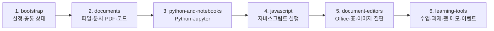

# JavaScript 파일별 기능 안내

**최종 업데이트: 2026년 8월 21일**

이 문서는 ClassDock의 JavaScript 파일이 각각 어떤 기능을 담당하는지 빠르게 찾기 위한 유지보수용 색인입니다. 기능을 추가하거나 파일 책임이 바뀌면 해당 행과 날짜를 함께 갱신합니다.

## 가장 먼저 알아둘 점

- 앱 실행 코드의 원본은 `src/js/*.js`입니다.
- 실제 로딩 순서와 계층은 `scripts.manifest.json`이 기준입니다. 새 파일을 만들면 HTML에 태그만 추가하지 말고 manifest에도 등록해야 합니다.
- `classdock-offline.html`과 `desktop/app.html`은 생성 파일입니다. 직접 수정하지 않습니다.
- 수정 후 `node build-offline.js`를 실행하면 모든 로컬·vendor JS가 오프라인 HTML 하나로 합쳐집니다.
- 각 파일은 ES module이 아닌 전역 스크립트입니다. 이름 충돌과 로딩 순서가 중요하므로 `npm run check`로 전역 선언·의존성 계약을 확인합니다.
- 자동 생성 파일인 `src/js/korean-font.js`는 직접 수정하지 않습니다.

## 앱 로딩 구조



## 1. bootstrap — 초기 설정과 공통 기반

| 파일 | 담당 기능 | 주로 함께 확인할 파일 |
|---|---|---|
| `state-sync.js` | EXE의 포트가 바뀌어도 설정이 유지되도록 로컬 서버와 `localStorage`를 동기화합니다. 같은 출처 요청에 실행별 인증 토큰을 붙이고 종료 직전 상태도 전송합니다. | `desktop/launcher.cs`, `state.js` |
| `theme.js` | 문서가 그려지기 전에 저장된 다크·라이트 테마를 적용해 초기 화면 깜빡임을 막습니다. | `state.js`, `src/styles.css` |
| `i18n.js` | 한국어·영어 사전, 매개변수 번역, DOM 텍스트·title·aria 자동 번역과 언어 전환을 담당합니다. 사용자에게 보이는 새 문구를 추가하면 이 파일의 영문 사전도 확인합니다. | 모든 UI 파일, `app.js` |
| `lazy.js` | 무거운 vendor 라이브러리를 시작할 때가 아니라 그 형식을 열 때 처음 불러오는 지연 로더(`MNLazy`)입니다. 엑셀·한글·PPT·Word·압축·캡처·맞춤법 사전 묶음과 로드 순서(JSZip 2.6.1 ↔ 3.x 교체)를 정의하며, 단일 파일 빌드에서는 `text/plain` 블록을, 서버 서빙에서는 `vendor/` 스크립트를 씁니다. 새 vendor 를 추가하면 `scripts.manifest.json`의 `lazy` 값과 이 파일의 묶음을 함께 맞춥니다. | `scripts.manifest.json`, `build-offline.js`, `spreadsheet-viewer.js`, `office-doc-viewers.js`, `tests/release-contract.test.js` |
| `interaction-core.js` | 분할 학습 화면의 문서 교체·역할 전환, 참고 잠금 입력 허용, 내부 탭 드래그와 외부 파일·폴더 드롭 판정을 DOM 없이 계산하는 순수 모듈(`MNInteractionCore`)입니다. | `core.js`, `documents.js`, `app.js`, `tests/study-mode.test.js` |
| `core.js` | 경로 정규화, 작업공간 마커, 인코딩 판별, Python 오류 설명·경로 분석, Markdown/HTML 살균, 코드 편집 순수 함수 등 여러 기능이 공유하는 기반 유틸리티 모음입니다. 기존 `ClassDockCore` 공개 API를 유지하며 상호작용 판정은 `interaction-core.js`에서 받아 제공합니다. | `interaction-core.js`, `documents.js`, `python-run-context.js`, `tests/core.test.js` |
| `icons.js` | 앱의 이모지형 버튼을 테마에 맞는 단색 SVG 아이콘으로 정리하고 동적으로 추가되는 UI도 관찰해 보정합니다. | UI를 만드는 모든 파일 |
| `state.js` | 열린 문서·탭·사이드바·학습 화면의 전역 상태, 앱 설정과 단축키, 공용 토스트·로딩 UI를 관리합니다. | `documents.js`, `app.js`, `i18n.js` |
| `history.js` | 편집기 공용 되돌리기·다시실행(`MNEditHistory`)입니다. 스냅샷 스택·상한(개수·총량)·redo 무효화·버튼 상태·연속 입력 묶기를 담당하고, 각 편집기는 capture·apply·isEqual 만 넘깁니다. PDF·표·노트북·이미지·화이트보드·파이썬 편집기가 모두 씁니다. | `pdf-recovery.js`, `spreadsheet-viewer.js`, `notebook-model.js`, `image-viewer.js`, `whiteboard.js`, `python-editor.js`, `tests/edit-history.test.js` |
| `search-history.js` | 최근 검색어(`MNSearchHistory`)입니다. 검색어를 구획(통합검색·편집기·PDF·노트북·표·일괄바꾸기)별로 `localStorage`에 12개까지 보관하고, 찾기 창을 열 때 마지막 검색어를 채워 주고 '최근 검색어' 드롭다운을 그립니다. 기록은 Enter·다음/이전·바꾸기처럼 실제로 검색을 쓴 순간에만 남기며, 찾기 옵션(대소문자·단어·정규식)도 함께 기억합니다. 설정 → 일반에서 끄거나 한 번에 지울 수 있고, '바꿀 내용'은 기억하지 않습니다. 여러 파일을 한꺼번에 바꾸는 자리(시트 찾기·바꿈, 여러 파일 찾아 바꾸기)에서는 목록만 보여 주고 자동으로 채우지는 않습니다. | `app.js`(통합검색), `python-editor.js`(편집기·가벼운 찾기), `code-viewer.js`(대용량·실행 결과), `pdf-editor.js`, `notebook-tools.js`, `spreadsheet-viewer.js`, `batch-replace.js`, `tests/search-history.test.js` |
| `special-chars.js` | 특수문자 문자표(`MNSpecialChars`)입니다. 브라우저 위에서 도는 편집기라 한글의 "ㅁ + 한자키"가 오지 않으므로, 커서 자리에서 우클릭 → 특수문자(또는 Ctrl+F10)로 문자표를 열어 ※ ○ ① ㎡ 같은 글자를 넣습니다. 문장부호·괄호·수학·단위·일반기호·화살표·선/표·원문자·로마/그리스·분수·한글 자모·가나·키릴·라틴·그림문자 묶음을 한자키 자모(ㄱ·ㄴ·ㄷ…)와 함께 보여 주고, 종류(별·화살표·분수…)로 거르며, 최근 쓴 글자 20개를 `localStorage`에 기억합니다. Shift+클릭이면 문자표를 닫지 않고 이어서 넣습니다. 표 셀처럼 contenteditable 인 자리는 `python-editor.js`의 `attachEditableContextMenu`가 선택 Range 기준으로 같은 메뉴를 띄웁니다. | `python-editor.js`(우클릭 메뉴·Ctrl+F10), `mnote.js`(글 블록·표 셀), `scratchpad.js`(글 블록·표 셀), `spreadsheet-viewer.js`(편집 중 셀·수식 입력줄), `tests/special-chars.test.js` |
| `spellcheck.js` | 외부 API 없이 동작하는 한국어 맞춤법·띄어쓰기 규칙 엔진(`MNKoreanSpellcheck`)과 공통 검사 패널, 교정 후보 적용, 무시·사용자 사전, 한글 조합 안전 재검사를 담당합니다. 일반 문서는 전체 글을, 마크다운은 코드 구간을 제외하고, 코드 파일은 주석·문자열만 검사합니다. 확실한 규칙 검사에 더해, 3MB가 넘는 **hunspell 한국어 사전 워커**(`vendor/korean-hunspell-worker.js`)는 시작할 때 싣지 않고 검사를 처음 실행할 때 `MNLazy`로 불러와 낱말 단위 오탈자까지 봅니다(45초 안에 못 받아오면 규칙 검사 결과만 씁니다). | `lazy.js`, `code-viewer.js`, `notebook-cells.js`, `scratchpad.js`, `mnote.js`, `tools/build-korean-spell-worker.mjs`, `tests/spellcheck.test.js` |

## 2. documents — 파일, 문서, PDF와 코드 보기

| 파일 | 담당 기능 | 주로 함께 확인할 파일 |
|---|---|---|
| `pdf-recovery.js` | PDF 편집 복구본을 IndexedDB에 저장·복원하고 PDF 편집 Undo/Redo 히스토리를 관리합니다. | `pdf-editor.js`, `pdf-pages.js`, `tests/pdf-recovery.test.js` |
| `video-viewer.js` | 영상·오디오 재생, SRT/VTT/SMI 자막 변환·자동 연결, EXE 영상 변환과 폴더 일괄 MP4 변환을 담당합니다. | `file-loaders.js`, `desktop/launcher.cs`, `tests/video-subtitles.test.js` |
| `document-types.js` | 지원 확장자·코드 강조 프로파일·ZIP 허용 형식과 파일 형식 판별, 사이드바 아이콘·색상 분류를 제공하는 순수 모듈(`MNDocumentTypes`)입니다. | `video-viewer.js`, `documents.js`, `file-loaders.js` |
| `documents.js` | 문서 객체 생성, 탭·사이드바·그룹 트리, 활성 문서 전환, 검색, 분할 작업, 새로고침·닫기 등 다중 문서 생명주기의 중심입니다. 형식 레지스트리와 표시 규칙은 `document-types.js`에서 받아 씁니다. 탭바는 파일이 하나만 열려 있어도 표시하고, 폴더·압축을 열 때 첫 파일을 자동으로 띄우지 않는 배치(`suppressUiBatchAutoOpen`)와 아무 문서도 없을 때의 빈 화면(`#docEmpty`) 전환도 여기서 관리합니다. | `document-types.js`, `state.js`, `file-loaders.js`, `viewer-base.js`, `tests/single-tab-and-auto-open.test.js` |
| `workspace-store.js` | 최근 작업공간을 서버 또는 IndexedDB에 바이너리로 저장·병합·삭제하고 재실행 시 파일·폴더·탭 상태를 복원합니다. | `file-loaders.js`, `desktop/launcher.cs`, `tests/folder-workspace.test.js` |
| `recent-files.js` | 최근 연 파일·폴더 목록(`MNRecent`)입니다. 목록은 `localStorage`에 두고, 다시 열 때는 이미 보관된 File System Access 핸들(`saveFsHandle`·`rememberFolderHandle`)을 찾아 권한 확인 1회로 되살립니다. 옮겨지거나 지워진 항목은 안내와 함께 목록에서 지울 수 있습니다. | `file-loaders.js`, `app.js`, `code-viewer.js`(핸들 보관), `tests/recent-files.test.js` |
| `file-loaders.js` | 파일·폴더·드래그 입력을 문서 종류별 로더로 전달합니다. 폴더 핸들, 빈 폴더, 새로고침, ZIP/TAR/GZ 해제, PPTX 변환 폴백을 관리합니다. | `documents.js`, `workspace-store.js`, 각 형식 뷰어 |
| `pdf-render.js` | PDF.js 문서 로딩, 페이지 자리표시자, 지연 캔버스 렌더링, 화질·배율·야간 모드와 한글 폰트 렌더링을 담당합니다. **보기 방식(이어보기 ↔ 한 장씩)**도 여기 있습니다 — `doc.pageMode`, 페이지 표시줄의 토글과 `◀ ▶`, 한 장씩 볼 때의 이웃 페이지만 그리기, 들어갈 때 한 번 하는 페이지 맞춤(나올 때 이전 배율 복원), `localStorage`에 남는 마지막 선택(`applyStoredPdfPageMode`)까지. 분할 작업에서는 칸마다 표시줄 한 벌씩을 붙여 **두 칸이 각자의 보기 방식**을 갖습니다(한 벌이 남의 칸 문서를 비추면 단추가 거짓말을 하므로 칸별로 그립니다). | `pdf-editor.js`, `pdf-pages.js`, `korean-font.js`, `tests/pdf-page-mode.test.js` |
| `pdf-ocr.js` | 스캔 PDF를 Tesseract로 OCR하고 결과를 문서 지문 기준으로 IndexedDB에 캐시해 PDF 검색과 사이드바 검색에 제공합니다. | `pdf-editor.js`, `documents.js`, `tests/lesson-ocr.test.js` |
| `pdf-editor.js` | PDF 확대·축소, 현재 페이지, 전체화면, 검색·강조, 서명·텍스트·날짜·체크·필기와 저장 UI를 담당합니다. 페이지 번호 입력·책갈피·검색 결과·코드 핀으로 뛰는 길은 한 장씩 보기에서 스크롤 대신 **그 쪽으로 넘기고**, 자판(`PageUp`·`PageDown`·`←`·`→`)은 분할 작업에서 **마지막에 누른 칸**의 PDF만 넘깁니다. | `pdf-render.js`, `pdf-pages.js`, `pdf-recovery.js`, `tests/pdf-page-mode.test.js` |
| `pdf-pages.js` | PDF 다운로드 바이트 생성, 책갈피 목차, 페이지 선택·추출·삭제·회전·순서 변경·합치기를 담당합니다. | `pdf-editor.js`, `pdf-recovery.js`, `tests/pdf-outline.test.js` |
| `viewer-base.js` | Office/텍스트 문서 로더의 공통 진입점입니다. Markdown, 일반 텍스트, HTML 상대 리소스, SQLite 읽기 전용 미리보기를 렌더합니다. | `office-doc-viewers.js`, `code-viewer.js`, `pptx-viewer.js` |
| `korean-font.js` | Pyodide Matplotlib용 NanumGothic gzip+base64 데이터입니다. 자동 생성 파일이므로 직접 수정하지 않습니다. | `python-runtime.js`, 생성 도구 |
| `workspace-python.js` | 열린 Python 파일을 백그라운드에서 읽어 모듈·심볼 색인을 만들고 자동 import 후보, 작업공간 import 진단, 로컬 정의 이동 대상을 제공하는 모듈(`MNWorkspacePython`)입니다. 캐시·사전 읽기 큐·Jedi 프로젝트 동기화 시점을 함께 소유합니다. | `code-viewer.js`, `core.js`, `tests/python-workspace-import-index.test.js` |
| `code-viewer.js` | 코드·설정 파일의 구문 강조와 줄번호, Python 실행 바, `.py`·텍스트 저장, 원본 핸들/자동 저장 폴더 분기, 노트북 변환, 정의 이동 연결을 담당합니다. 실행 바의 **따라치기**(교본 위에 그대로 쳐 보는 타자 연습) 버튼과 진행률·정확도 표시, 편집 화면과 읽기 화면 양쪽의 **줄 번호로 이동(Ctrl+G)** 진입점도 여기서 답니다. 작업공간 Python 색인과 자동 import는 `workspace-python.js`를 사용합니다. | `workspace-python.js`, `python-editor.js`, `python-runtime.js`, `python-run-context.js` |

## 3. python-and-notebooks — Python 편집·실행과 Jupyter

| 파일 | 담당 기능 | 주로 함께 확인할 파일 |
|---|---|---|
| `python-snippets.js` | Python 예제 갤러리, 난이도·검색 필터, 예제 열기, 로컬 Python import 색인과 자동완성 후보 준비를 담당합니다. | `python-editor.js`, `desktop/launcher.cs` |
| `python-editor.js` | 자체 코드 편집기 UI를 만듭니다. 줄번호, 구문 강조, 자동 들여쓰기, 찾기·바꾸기, 자동완성, 다중 캐럿, 셀 경계, 오류 줄과 정의 이동을 관리합니다. 또한 **열 편집**(`Alt`+세로 드래그)의 사각 선택 오버레이와 그 전용 클립보드(복사·잘라내기·붙여넣기), **코드 따라치기** 엔진(교본 대조·오타 표시·진행률), **줄 번호로 이동 미니 창**, 우클릭 상황 메뉴(복사·대소문자 변환·선택한 줄 중복 제거·특수문자 `Ctrl+F10`)와 `contenteditable` 자리용 `attachEditableContextMenu`를 담당합니다. | `code-viewer.js`, `python-snippets.js`, `special-chars.js`, `tests/python-editor-word-select.test.js` |
| `python-run-context.js` | 함께 연 프로젝트 파일을 실행 번들로 구성하고 Python의 작업폴더·프로젝트 루트·상대경로·import·출력 파일 경로를 계산합니다. | `file-loaders.js`, `python-runtime.js`, `tests/python-path-helper.test.js` |
| `python-runtime.js` | Python 실행의 총괄입니다. EXE 로컬 Python과 브라우저 Pyodide를 선택하고 패키지 준비, 입력, 스트리밍 출력, 중지, 진단·단계 실행, 결과 파일 수집을 처리합니다. | `python-run-context.js`, `desktop/launcher.cs`, `korean-font.js` |
| `python-terminal.js` | Python 편집기의 결과/터미널 전환, 명령 기록·중지·초기화, EXE의 지속형 로컬 PowerShell 세션과 브라우저의 상태 유지 Pyodide 콘솔을 담당합니다. 터미널은 `sharedPythonTerminal()`로 앱에 하나만 만들고 각 문서는 자기 터미널 버튼만 등록(`attach`)·해제(`detach`)하므로, 열려 있는 파이썬 파일들이 세션·변수·명령 기록을 함께 씁니다. 다른 파일에서 열면 작업 폴더만 그 파일 폴더로 자동 이동(`Set-Location`)하고, 같은 파일에서 다시 열 때는 사용자가 직접 옮긴 폴더를 유지합니다. 마지막 파이썬 문서가 닫히면 잠깐 뒤(새로고침 대비) 셸과 전역 단축키를 정리합니다. | `code-viewer.js`, `python-runtime.js`, `desktop/launcher.cs`, `tests/python-terminal-shared.test.js` |
| `notebook-model.js` | `.ipynb` 파싱·직렬화, 셀·출력 모델, 복구본·자동 저장, 실행 상태 해시, 셀 추가·삭제·이동 같은 DOM 비종속 모델 기능을 담당합니다. 노트북 언어 판별(`notebookLanguageOf` — metadata 의 kernelspec·language_info)도 여기 있어 실행기·강조·커널이 같은 기준을 씁니다. | `notebook-run.js`, `notebook-cells.js`, `tests/notebook-serialize.test.js` |
| `notebook-tools.js` | 노트북 실행 작업공간과 파일 번들, 로컬 셀 커널 선택·시작·중지, 로컬 Python 설치 안내와 커널 통신을 담당합니다. | `notebook-model.js`, `python-runtime.js`, `desktop/python_kernel.py` |
| `notebook-run.js` | 노트북 전체 화면과 상단 도구막대를 만들고 셀 렌더링, 전체 실행, 저장, 목차, 찾기, 출력 메뉴, 커널 상태 UI를 연결합니다. | `notebook-model.js`, `notebook-tools.js`, `notebook-cells.js` |
| `notebook-pdf-export.js` | 노트북을 A4 PDF로 내보냅니다. 셀 경계를 고려한 페이지 분할, 캔버스 배치, 지도·iframe 리치 출력 스냅샷을 처리합니다. | `notebook-run.js`, `tests/pdf-layout.test.js` |
| `notebook-cells.js` | 개별 코드·마크다운·Raw 셀 UI, 셀 실행·입력, 선택·복사·붙여넣기, 드래그 순서 변경, 접기, 메모 보내기와 셀 도구 버튼을 담당합니다. | `notebook-run.js`, `python-editor.js`, `scratchpad.js` |

## 4. javascript — 자바스크립트 연습 실행

| 파일 | 담당 기능 | 주로 함께 확인할 파일 |
|---|---|---|
| `js-libraries.js` | 자바스크립트 실행용 오프라인 라이브러리 카탈로그(Lodash·Day.js·Papa Parse·Math.js), 문서별 선택·로컬 `.js` 보관, EXE의 npm 설치 캐시 조회·설치 진행/취소·삭제·번들 로드, Worker에 넣을 원문 준비와 전역 자동완성 목록을 담당합니다. npm 패키지는 런처가 고정된 esbuild로 브라우저용 번들을 만든 뒤 전달합니다. | `js-runtime.js`, `js-editor.js`, `lazy.js`, `scripts.manifest.json`, `desktop/launcher.cs`, `desktop/npm_package_runner.js` |
| `js-runtime.js` | `.js`·`.mjs` 실행의 총괄입니다. 실행마다 Blob 워커를 새로 띄워 `console` 출력을 스트림(보통·경고·오류)별로 모으고, `input()`·`prompt()`를 입력값 칸과 잇고, 실행 전 문법 검사·스택에서 사용자 코드 줄 번호 찾기·10초 시간 제한·중지를 처리합니다. 출력은 모아 뒀다 한 번에 주지 않고 **실행 중에 조금씩 흘려보내서**(시간 80ms 또는 8KB 기준) 오래 걸리는 코드도 진행이 보이고, 중지하거나 시간이 넘어 워커를 끊어도 그때까지 찍힌 내용이 남습니다. 엔진이 문법 오류의 위치를 알려주지 않으므로 소스를 훑어 **닫히지 않은 괄호·따옴표의 줄**을 짚고, 자주 나는 오류에는 한국어 도움말 카드를 붙입니다. **자동완성**도 여기서 정합니다 — 낱말 목록은 이 실행 환경에서 실제로 되는 것만 담고(`document`·`require` 제외, `input`·`prompt` 포함), 점(`.`) 뒤 멤버는 잘 알려진 전역 카탈로그(`console`·`Math`·`JSON`…)와 리터럴 추론(배열·문자열·수·Map·Set·객체 리터럴의 키)으로 답합니다. 알 수 없으면 아무것도 내지 않습니다. 별도 런타임을 내려받지 않고 브라우저 엔진을 그대로 씁니다. **과제 자동채점**(`runJsGrading`)은 테스트마다 워커를 새로 띄워 코드를 처음부터 다시 돌리므로 테스트끼리 변수가 섞이지 않고, 보고서 모양이 파이썬과 같아 채점 결과 화면(`renderAssignmentGradingResult`)을 그대로 씁니다. 노트북용으로는 문서마다 워커를 살려 두는 **커널**(`startJsKernelRun`)도 제공합니다 — 셀을 전역에서 실행해 앞 셀의 값이 이어지고, 결과 모양은 Pyodide 커널과 같게 맞춰 노트북 화면이 그대로 씁니다. | `js-editor.js`, `notebook-run.js`, `tests/js-runtime.test.js` |
| `js-editor.js` | `.js`·`.mjs` 편집·실행 화면을 만듭니다. 파이썬과 같은 실행 바·좌우 분할·출력 패널 뼈대를 쓰되 실행/채점/저장/원본 되돌리기만 두고, 편집기·초안·저장·분할선·채점 테스트 편집 창은 파이썬 쪽 공용 함수를 재사용합니다(채점 테스트 저장 자리는 `classdock-js-grade:` 로 파이썬과 분리). 과제 패키지(`.task`) 내보내기는 아직 파이썬(`main.py`) 전용이라 넣지 않습니다. | `js-runtime.js`, `code-viewer.js`, `python-editor.js`, `python-run-context.js` |

## 5. document-editors — Office, 표, 이미지와 화이트보드

| 파일 | 담당 기능 | 주로 함께 확인할 파일 |
|---|---|---|
| `office-doc-viewers.js` | DOCX, HWP, HWPX의 미리보기와 Office 암호화 문서 판별·복호화 보조를 담당합니다. `.docx`는 미리보기를 그린 뒤 `MNDocxEditor`의 문단 편집 토글을 붙입니다(암호를 풀어 연 문서는 저장하면 암호가 사라지므로 붙이지 않습니다). | `viewer-base.js`, `file-loaders.js`, `docx-editor.js` |
| `docx-editor.js` | Word(.docx) 제자리 편집 화면(`MNDocxEditor`)입니다. docx-preview 문단과 XML을 대조하고 어긋나면 임시 북마크로 정확한 위치를 다시 찾습니다. 드래그한 글자 범위 또는 문단 전체의 글자 서식, 문단 배치·글머리표/번호·서식 복사/붙이기, 표 행/열·셀 서식·오른쪽 병합/가로 분할, 용지 방향·여백·머리글/바닥글, PNG/JPG/GIF 추가·교체·크기를 편집합니다. 제자리 문단 우클릭 메뉴는 이 기능들과 복사·잘라내기·붙여넣기·특수문자·문단 추가/삭제·이력·저장을 대상별 하위 메뉴로 제공하며 상단 도구와 같은 실행 경로를 씁니다. XML과 추가 패키지 파트의 버전을 함께 기록해 Ctrl+Z/Ctrl+Y로 되돌리고, 세로 병합·중첩 표처럼 위험한 구조는 제한합니다. | `office-replace.js`, `office-doc-viewers.js`, `docs/워드-문단편집-설계.md`, `tests/office-replace.test.js`, `tests/docx-context-menu.test.js` |
| `spreadsheet-formula.js` | 표 편집기의 순수 수식 엔진(`MNSpreadsheetFormula`)입니다. 수식 파싱·계산, 셀/시트 참조 재작성, 날짜·텍스트·조회 함수, 자동 채우기 패턴과 자동합계 작업 계획을 담당하며 브라우저 없이 테스트할 수 있습니다. | `spreadsheet-viewer.js`, `tests/xlsx-edit.test.js` |
| `spreadsheet-viewer.js` | XLSX/XLS/CSV 로딩과 시트 UI, 셀 편집·선택·복사, 행/열·병합·서식·필터·정렬, 저장과 새 표 생성을 담당합니다. 수식 계산과 참조 변환은 `spreadsheet-formula.js`를 사용합니다. | `spreadsheet-formula.js`, `spreadsheet-chart.js`, `tests/xlsx-edit.test.js` |
| `spreadsheet-chart.js` | 선택한 표 범위에서 차트에 적합한 데이터를 추론하고 막대·선·원형 SVG 차트를 생성합니다. | `spreadsheet-viewer.js` |
| `pptx-viewer.js` | PPTX 간이 슬라이드 미리보기, 슬라이드 맞춤, 포함 폰트 변환과 상대 리소스 경로 해석을 담당합니다. EXE의 정확한 PDF 변환 실패 시 사용됩니다. | `file-loaders.js`, `office-doc-viewers.js` |
| `image-viewer.js` | 이미지 보기·확대·회전·뒤집기·자르기·내보내기, 작업공간 복구와 폴더 이미지/PDF 갤러리를 담당합니다. | `file-loaders.js`, `documents.js` |
| `image-lightbox.js` | 파이썬 실행 결과 그래프와 노트북 출력 그림을 클릭하면 큰 오버레이 창으로 띄우고 확대·이동·넘기기·PNG 저장·메모 보내기를 제공합니다. | `python-runtime.js`, `notebook-cells.js`, `image-viewer.js` |
| `board-render.js` | 화이트보드와 수업 리플레이가 공유하는 선·도형·텍스트·이미지 벡터 렌더러입니다. 교육 도형 같은 `group` 항목을 자식까지 재귀로 그리고 좌우·상하 반전(`flipX`/`flipY`)을 부모→자식으로 물려주며, 선택 판정(`hitTestItem`)·경계 계산·항목 이동도 여기 순수 함수로 둡니다. | `whiteboard.js`, `lesson-replay.js`, `tests/board-render.test.js` |
| `board-tools.js` | 화이트보드의 수학·과학 계산 도구를 DOM 없이 모아 둔 순수 모듈(`MNBoardTools`)입니다. **함수 그래프**(eval 없는 수식 파서 → 표본 추출 → 축·눈금·범례와 잘라 낸 곡선, 보드에 함께 그리는 **매개변수 슬라이더**와 손잡이 히트테스트, **교점·접선·구간 넓이(정적분·리만 직사각형)·부등식 영역**), **표**(칸 너비를 글자 폭으로 어림해 그리는 공용 `tableGroup` — **값의 표·자료 요약 카드·도수분포표·화학량론 표**), **자료 차트**(막대·꺾은선·원·히스토그램·산점도·**상자그림**, 산점도 **최소제곱 추세선**), **통계**(`describeData` — 학교식 사분위수·최빈값·표준편차), **손그림 도형 정리**(펜 획 → 직선·원·삼각형·사각형 인식), **교구 기하**(자 모서리 스냅·15° 각도 스냅·각도기 읽기·컴퍼스 호), **변환 기하**(평행이동·회전·선대칭·점대칭·닮음 — 그룹은 풀었다 다시 묶고 기울어진 사각형은 다각형으로), **동적 측정**(길이·각도·넓이 계산), **화학**(118개 원소 주기율표·원소 카드·화학식 파서·유리수 가우스 소거로 반응식 계수 맞추기·**몰질량과 화학량론**), **확률 실험**(동전·주사위·무작위 수·**주머니(복원/비복원)·스피너** → 차트 자료, **누적 상대도수(큰 수의 법칙)** 그래프), **수 모형**(분수 막대/원·자릿값 블록·수직선 뛰어세기·양팔 저울), **벡터 합성**(평행사변형·합력·각도), **광학**(렌즈·거울 광선 작도와 상 계산), **유전**(퍼넷 사각형·비율), **회로**(직렬·병렬 합성저항과 전압/전류)을 모두 `board-render.js` 가 그대로 그리는 벡터 항목으로 돌려줍니다. | `whiteboard.js`, `tests/board-tools.test.js` |
| `whiteboard.js` | 독립 화이트보드 문서 전체입니다. 그리기 도구(펜·형광펜·지우개·직선·화살표·사각형·원·텍스트), 선택·이동·크기 조절, 이미지 넣기, Undo/Redo, 복구 저장과 리플레이 녹화 연결이 기본이고 다음이 함께 들어 있습니다. **화면 배율·이동**(휠·`−`/`100%`/`+` 버튼·`Space`+드래그·휠 클릭 드래그, 0.25~4배, 순수 함수 `whiteboardClampView`·`whiteboardZoomAt`), **좌우·상하 반전**(이미지·교육 도형), **보드 배경색**(프리셋·직접 고르기·펜 색 자동 대비), **수학·과학 도구상자**(기호·수식 사전·도형·과학 스텐실, 떠 있는 창 이동·크기), **LaTeX 수식 항목**(원문 보존·재편집), **함수 그래프·자료 차트·주기율표**(도구상자 그래프/차트/화학 탭 — 식·자료 입력, 미리보기, 매개변수 슬라이더, 확률 실험, 반응식 균형, 넣은 뒤 더블클릭 재편집), **보드 위 슬라이더 끌기**(교구 다음·판서보다 먼저 잡고, 끄는 동안은 되돌리기 칸을 만들지 않다가 손을 뗄 때 한 번만 기록), **그래프 해석**(교점·접선·구간 넓이·부등식 관계 기호), **표 만들기**(값의 표·요약 카드·도수분포표·몰 계산표 — 종류마다 만든 재료를 들고 있어 더블클릭 재편집), **수 모형·과학 계산 탭**(공용 `makeToolBuilder` — 종류 칩 + 그 종류의 칸만 보이는 폼, role `education-tool`+`toolSpec` 으로 재편집), **벡터 합성**(같은 점에서 출발한 두 화살표를 골라 합력을 붙이는 파생 항목 — 그릴 때마다 다시 계산하고, 합성에 쓰인 화살표는 끝점 손잡이로 길이·방향을 끌 수 있다), **변환 패널**(대칭·회전·평행이동·닮음, 기준점 찍기, 원본 남기기), **측정 라벨**(그릴 때마다 다시 재는 길이·각도·넓이 text 항목), **교구**(자 모서리 스냅·각도기 1° 스냅·컴퍼스 호/원·15° 각도 스냅·길이/각도 딱지, 내보내기에서는 제외), **손그림 정리**(펜 획 → 반듯한 도형), **집중 도구**(스포트라이트·화면 가리개·조절점 숨김·손전등), **우클릭 빠른 메뉴**(선택 항목 편집·복사/잘라내기/붙여넣기·복제·레이어 4방향 이동·반전·측정 붙이기·떼기·변환·분리·삭제 / 보드 작업·그래프·차트·주기율표·교구·정리 묶음·출력·녹화·도구막대 표시와 위치·도구·색·굵기·크기 직접 입력·이력), **편집 도구막대 숨기기/보이기**, **인쇄**(`doc.printBoard`)와 **메모창 왕복**, 그리고 **바깥에서 그림 받기**(`doc.insertBoardImage(dataUrl)` — 지도 문서가 쓰는 공개 훅. 손으로 넣은 그림과 같은 `placeImage` 를 타므로 크기 맞춤·선택·되돌리기·리플레이 녹화가 똑같이 동작하고, 자동복원이 바깥 주소에 매이지 않게 data URL 만 받습니다), **지도 넣기**(`🗺️` → `openMapPicker()` 로 자리를 골라 배경지도를 그림으로 삽입 — map-viewer 는 이 파일보다 뒤에 실행되므로 서로 실행 시점에 확인해 부릅니다). | `board-render.js`, `board-tools.js`, `lesson-replay.js`, `scratchpad.js`, `docs/화이트보드-집중도구-설계.md`, `tests/whiteboard-*.test.js` |
| `map-viewer.js` | 지도 문서(`.map`)입니다. Leaflet(`vendor/leaflet.min.js`, `MNLazy`의 `leaflet` 묶음)으로 배경지도를 띄우고 표시(마커)를 찍어 이름·메모·색을 붙이고 끌어 옮기며, 좌표로 이동·배경지도 바꾸기(일반·지형·흑백·위성)를 제공합니다. `.map`은 중심 좌표·확대·표시 목록을 담은 JSON이라 통합검색·되돌아 열기와 잘 맞습니다. **카카오·네이버 지도를 쓰지 않은 이유**: 두 SDK 모두 JS 키에 사이트 도메인을 등록해야 하는데 이 앱은 실행마다 127.0.0.1의 빈 포트를 잡고 오프라인 HTML은 `file://`로도 열려 등록할 주소가 없고, 키가 배포본에 실려 퍼지며 타일 저장도 약관이 막습니다. 라이브러리는 vendor에 있어 오프라인이고 인터넷은 배경 타일에만 필요합니다. exe로 돌 때는 배경 타일을 런처의 `/tile-proxy`로 받아 **화면에 실제로 표시된 타일만** 서버 디스크에 자동 캐시하며(계속 실패하면 조용히 직접 주소로 되돌립니다), 공개 지도 서버가 금지하는 보지 않은 범위·확대 단계의 사전 다운로드는 하지 않습니다. 배경지도 호스트는 `launcher.cs`의 `TileProxyHosts` 허용 목록과 항상 같아야 합니다(`tests/map-viewer.test.js`가 검사). **`🖊️ 칠판으로`**는 지금 보이는 지도를 PNG 로 굳혀 새 화이트보드에 올립니다 — 타일이 다 들어오길 기다린 뒤 확대·이동 단추와 말풍선·이름표 칸을 감추고(닫은 말풍선은 페이드아웃 때문에 200ms 가량 DOM 에 남아 그냥 찍으면 편집 서식이 지도 한복판에 박힙니다) `htmlToImage` 로 찍고, 캔버스에서 표시 이름과 출처를 그림에 새겨 넣습니다(정지 그림이라 말풍선으로는 이름이 남지 않고, OSM 라이선스상 출처도 함께 있어야 합니다). 칠판은 빈 스냅샷을 지금 시각으로 넘겨 열어 같은 이름으로 쓰던 옛 판서가 되살아나지 않게 하고, 렌더 뒤 `doc.insertBoardImage` 로 그림을 넣습니다. 지도 문서는 그대로 남습니다. **`openMapPicker()`**는 반대 방향입니다 — 칠판의 `🗺️` 가 부르는 지도 고르기 창으로, 자리를 잡아 '이 화면 넣기'를 누르면 캡처한 PNG 를 돌려줍니다(지도 문서를 만들지 않고 그림만 가져가는 길이며, 마지막 자리를 기억합니다). 검색칸은 **검색 버튼과 Enter를 같은 실행 경로로 연결**하고 프록시 확인보다 먼저 이벤트를 붙여 창을 연 직후에도 입력을 놓치지 않습니다. **`🗂️ 오프라인 지도`**는 자동 캐시 현황과 400MB 상한·비우기를 보여 주며 프록시가 있을 때(=런처로 실행)만 붙습니다. 프록시 유무는 `/can-proxy-tiles` 로 확인합니다(저장 가능 여부와 다른 능력이라 프로브를 따로 둡니다 — Go 폴백 런처는 저장은 못 해도 타일은 받습니다). **장소 이름 검색**(`mapGeocode`·`mapAttachPlaceSearch`)은 런처의 `/geocode`만 거칩니다. 런처가 식별 User-Agent·초당 1건 제한·검색 캐시를 적용하고 `CLASSDOCK_GEOCODER_URL`로 Nominatim 호환 HTTPS 공급자를 바꿀 수 있습니다. `file://`에서는 이름 검색을 막고 좌표처럼 생긴 입력(`mapParseCoords`)만 조회 없이 바로 이동합니다. 도구막대는 두 줄(늘 남는 머리말 `.map-bar` + 접히는 `.map-tools`)이라 **`▤ 도구 숨기기`(자판 `H`)** 로 편집 도구만 접어 지도를 넓게 볼 수 있습니다 — 접어도 우클릭 메뉴(`contextMirror(toolsToggleBtn)`)로 되돌아오고, 접은 상태는 `.map` 이 아니라 `localStorage`(`mapToolbarVisible`)에 남습니다. ⛶ 전체화면에서는 머리말까지 임시로 접고 나오면 되돌립니다(`fullscreenchange` + `body.viewer-fullscreen` 클래스 감시 — 창 안 폴백에는 이벤트가 없습니다). 지도 문제(학생) 화면은 두 줄 다 접은 채로 두고 토글 자체를 내놓지 않습니다. **표시 이름 늘 보이기(`🏷️`)** 는 마커 툴팁을 상시 표시로 바꾸되 확대 13단계 미만에서는 접고(이름표가 포개져 못 읽습니다) 표시 200개(`MAP_LABEL_MAX_MARKERS`)를 넘으면 켜지지 않으며, 켠 상태는 `.map`(버전 4)에 저장됩니다 — 칠판·PNG·인쇄 그림에는 이 값과 상관없이 언제나 모든 이름이 새겨집니다. **카카오 연동**(REST 키가 있을 때)은 세 갈래입니다 — `🔎 장소 정보`(누른 좌표 역검색, 확대 15단계 이상), `🏫 주변 시설`(카카오 갈래 18가지 중 **다섯까지**(`MAP_NEARBY_MAX_KINDS`) 동시 검색, 개수는 갈래당이 아니라 **전체 최대**(`MAP_NEARBY_TOTAL_CHOICES` 30·45·75·100, 기본 75)를 갈래끼리 고르게 나누고 한 갈래 45곳(`MAP_NEARBY_MAX_PER_KIND`)을 넘기지 않음, 겹치는 갈래 색은 자동으로 비껴 줌, 넣은 것에는 `source:"nearby"`·`batch` 꼬리표가 붙어 되돌리기·🧹 지우기가 묶음째 뭅니다), `🗺 카카오맵 상세 보기`(`openMapKakaoPlaceModal` — `place.map.kakao.com/<숫자>` 만 통과시키는 `mapKakaoPlaceUrl` 로 URL을 다시 검사하고, **같은 `batch` 로 들어온 시설만** 한 벌로 묶어 iframe **하나를 갈아 끼우며** `‹ · ›`·`←`·`→` 로 순환 이동, 카카오 안내에 따라 페이지를 덮거나 자르지 않습니다). **`🧾 표로 메모`** 는 `window.addTableToScratchpad` 로 표시 정보를 메모 표 블록으로 보내고(메모용은 `mapMarkersToMemoRows` 의 여덟 칸, 저장용 CSV는 `mapMarkersToRows` 로 모든 필드), 상한에 걸려 빠진 줄 수를 받아 알립니다. **거리선·면적 그리기**는 첫 점 이후 마지막 점부터 커서까지 점선 안내선(`draftGuideLayer`)을 그리고, 그리는 중의 **우클릭은 빠른 메뉴 대신 `finishDrawing(true)`**(`Enter`·같은 버튼 다시 누르기와 한 길)이며 점이 모자라면 브라우저 메뉴를 막고 안내만 보여 줍니다. 그 밖에 축척 막대·방위표·`🌐` 위경도 격자, `🧾` 표시 목록과 묶음 감추기, `🎬` 발표 모드, 표시 사진(base64·합계 12MB), CSV 들이기·내보내기와 주소 역검색·지역 통계, `📷` PNG·`🖨️` 인쇄, `📋` 메모 왕복, `🎯` 지도 문제(`.task`) 출제·풀이가 이 파일에 함께 있습니다. 지도 탭을 닫으면 `cleanupFns`에서 Leaflet·ResizeObserver·전역 키 리스너를 함께 해제합니다. | `lazy.js`, `documents.js`, `file-loaders.js`, `code-viewer.js`, `whiteboard.js`(`insertBoardImage`), `desktop/launcher.cs`(`/tile-proxy`·`/geocode`), `vendor/leaflet.min.js`, `tests/map-viewer.test.js` |
| `timeline.js` | 연대표 문서(`.timeline`)의 모델과 편집 화면입니다. 연도·연월·날짜와 기원전(BC/BCE)을 해석해 사건과 기간을 시간순으로 정렬하고, 사건 제목·설명·분류·색·사진을 카드로 표시합니다. 균등/시간 비례 배치, 확대·축소, 검색 목록, 발표 모드, 세로 인쇄, 표 들이기(CSV·xlsx)·CSV 내보내기, 되돌리기·다시 실행, 자동 복구와 저장을 담당합니다. 사진은 긴 변 1280px·JPEG 로 줄여 data URL 로 넣고 문서 전체 사진 용량을 40MB로 제한하며, 통합검색에는 base64 본문을 제외한 텍스트만 제공합니다. **엑셀 들이기**는 `MNLazy`의 `exceljs` 묶음으로 첫 시트를 읽어 CSV와 같은 열 해석 규칙(`timelineEventsFromRows`)을 쓰고, 시트에 떠 있는 그림은 앵커의 `nativeRow` 로 그 줄의 사건에 붙입니다(`timelineSheetImageRows` — 줄당 한 장, png·jpeg·webp만. 리치값 ‘셀에 배치’ 이미지와 `IMAGE()` 는 지원하지 않습니다). **되돌리기·수정 여부 판정은 사진 바이트를 복사하지 않습니다** — `timelineSnapshot` 이 사진을 뺀 값만 문자열로 뜨고 사진은 객체 참조로 공유해(`timelineSnapshotEqual` 은 참조 비교) 80단계 기록과 타자마다 도는 비교가 문서 크기에 끌려가지 않습니다. 발표 화면은 연도를 카드 왼쪽 위에, 유적지를 오른쪽 아래 지도 아이콘(툴팁 → 지도 검색)에 두고 사진은 남은 높이에 맞춰 줄입니다. | `documents.js`, `file-loaders.js`, `history.js`, `code-viewer.js`, `tests/timeline.test.js` |

> 지도 모델 버전 2는 기존 버전 1과 하위 호환되며, 사용자 이미지 배경(`backgroundImage`), 거리선·면적 영역(`shapes`), 구면 거리·면적 계산, 표시 CSV 왕복을 추가합니다. 이미지는 긴 변 2400px 안으로 정리해 data URL로 포함하고, 거리·면적 라벨은 칠판 캡처에도 다시 새깁니다.

## 6. learning-tools — 수업, 과제, 펫, 메모와 앱 이벤트

| 파일 | 담당 기능 | 주로 함께 확인할 파일 |
|---|---|---|
| `remote-terminal.js` | EXE 전용 SSH 원격 터미널 화면입니다. 서버 주소·포트·계정·암호 입력, 최초 접속 전 서버 키 지문 확인, xterm.js 터미널 입출력·크기 동기화·연결 종료를 담당합니다. 현재 문서와 좌우 도킹하고 분할선 너비 조절·좌우 교환·연결 유지 접기를 제공하며 방향과 너비를 기억합니다. SSH 종료 출력을 분석해 인증·시간 초과·거부·DNS·네트워크·지문 오류를 구분하고, IP·포트·계정을 유지한 비밀번호 재입력 재접속과 무한 상태 재시도 방지를 제공합니다. 주소·포트·계정만 선택적으로 저장하고 암호는 저장하지 않습니다. | `lazy.js`, `classdock.html`, `desktop/ssh_terminal.cs`, `desktop/launcher.cs`, `tests/remote-terminal.test.js`, `docs/원격터미널-설계.md` |
| `lesson-replay.js` | `.lesson` 데이터 검증, 화이트보드·PDF·Python 이벤트 녹화, 타임라인 재생·탐색·속도 조절과 파일 저장을 담당합니다. | `board-render.js`, `whiteboard.js`, `code-viewer.js` |
| `diff-viewer.js` | 파일 비교(diff) 문서: patience diff 자체 구현, 나란히/한 줄 보기, 공백 무시·접기, 두 파일 선택 모달과 저장본 비교, 과제 시작 코드 비교 진입점을 담당합니다. | `documents.js`, `task-package.js`, `command-palette.js`, `tests/diff-viewer.test.js` |
| `office-replace.js` | Word(.docx)·PowerPoint(.pptx) 찾아 바꾸기와 Word 편집 순수 코어(`MNOfficeReplace`)입니다. 여러 run에 쪼개진 글자 되쓰기, 선택 run 분할 서식, 문단/목록/표/페이지/머리글·바닥글/그림 XML 및 관계·콘텐츠 형식 계획을 담당합니다. 브라우저부는 zip.js로 필요한 파트를 한 번만 풀고, `build`가 바뀐 엔트리를 교체하면서 새 `numbering.xml`·머리글/바닥글·미디어 엔트리도 추가하며 손대지 않은 엔트리는 그대로 복사합니다. | `batch-replace.js`, `docx-editor.js`, `lazy.js`(`zip` 묶음), `office-doc-viewers.js`, `docs/오피스-찾아바꾸기-설계.md`, `tests/office-replace.test.js`, `tests/office-replace-roundtrip.test.js` |
| `batch-replace.js` | 여러 파일 찾아 바꾸기: 열린 텍스트·코드 문서와 **Word(.docx) 본문·PowerPoint(.pptx) 슬라이드**에서 한꺼번에 찾아 바꾸기(대소문자·정규식·그룹 치환), 미리보기 체크리스트, `saveTextDoc({silent,existingOnly})`로 조용히 저장, 되돌리기를 담당합니다. 오피스 문서는 `MNOfficeReplace`로 계산해 저장하며(File System Access 핸들이면 **원본**, 없으면 exe `/save-file` 로 자동 저장 폴더에 **사본** — 어느 쪽인지 결과 문구로 알립니다), 저장하지 못하면 화면도 바꾸지 않습니다(편집기가 없어 "바뀐 줄 알았는데 파일은 그대로"를 막기 위해). 본문 밖(머리말·꼬리말·각주·발표자 노트) 포함 여부와 변경 이력 문서 허용은 설정▸문서에서 정하고, 바꾸지 않은 곳은 "머리말 2곳"처럼 숫자로 알립니다. 미리보기 줄 이름표는 Word 가 `문단 12`, PowerPoint 가 `슬라이드 3`입니다. | `documents.js`, `code-viewer.js`, `office-replace.js`, `command-palette.js`, `tests/batch-replace.test.js` |
| `task-package.js` | `.task` 과제 만들기·검증·내보내기, `.taskdone` 제출본 생성·검수·재채점, 일괄 검수와 성적 CSV를 담당합니다. | `python-runtime.js`, `file-loaders.js`, `tests/task-package.test.js` |
| `exam-paper.js` | 시험지 만들기·배포·응시·채점: 객관식/주관식·이미지 문항 편집, 선생님 암호로 잠근 원본 `.examkey`, 최신 원본과 버전이 일치하는 정답 제거 배포본 `.exam`(열기 암호 선택), 학생 임시 저장·이름·서명 후 공개키로 봉인한 제출본 `.examdone`, 봉인 내부 신원·버전을 검증하는 일괄 채점표, 수동 채점 영구 저장과 시험별·누적 성적 CSV를 담당합니다. 교실 LAN 제출도 여기서 다룹니다 — 선생님의 [제출 받기](EXE 의 제출 전용 리스너 개폐·접수 목록 폴링)와 학생의 [선생님 PC 로 바로 보내기](주소·6자리 코드·연결 확인, 실패하면 파일 제출로 폴백)입니다. | `file-loaders.js`, `documents.js`, `pdf-editor.js`(`trimCanvas`), `code-viewer.js`(서버 저장), `desktop/launcher.cs`(제출 수신), `tests/exam-paper.test.js` |
| `screensaver.js` | 유휴 화면 시계·영상·웹 주소(iframe) 표시, 영상 목록 IndexedDB 저장, 재생 가능성 검사, 삽입 차단 판정과 폴백(웹 → 영상 → 시계), 전체화면 종료를 담당합니다. 웹 주소는 크로스 오리진 iframe이라 입력이 부모로 올라오지 않으므로 투명 막을 덮어 해제 입력만 받고 이동·다운로드를 막습니다. 주소 정규화(http/https만 통과·스킴 보정)와 유튜브 → 퍼가기 주소 변환(반복 재생용 `playlist`·`mute`·시작 시간 이전)은 `state.js`·`app.js` 설정 화면 쪽에 있습니다. | `app.js`, `state.js`, `tests/screensaver-web.test.js` |
| `pet-data.js` | 픽셀 펫 종족별 스프라이트, 팔레트, 이름과 기본 대사를 정의합니다. | `pet.js`, `pet-custom.js` |
| `pet-custom.js` | 펫 대사 편집, 사용자별 종족 대사, 나만의 펫 외형 조합과 저장·복원을 담당합니다. | `pet-data.js`, `pet.js` |
| `pet-events.js` | 펫 행동 도감의 고유 이벤트 이름과 한국어·영어 설명을 정의합니다. | `pet.js`, `tests/pet-events.test.js` |
| `pet.js` | 픽셀 펫의 이동·점프·플랫폼 탐색·행동·대사·드래그·이벤트 도감과 실제 DOM 애니메이션 엔진입니다. | `pet-data.js`, `pet-custom.js`, `pet-events.js` |
| `pet-focus.js` | 집중·휴식 타이머, 오늘 완료 횟수, 타이핑 중 조용한 상태와 집중 모드에 따른 펫 행동을 관리합니다. | `pet.js`, `state.js`, `tests/pet-focus.test.js` |
| `data-convert.js` | 데이터 형식 변환 공용 모듈(`MNDataConvert`)입니다. JSON·JSONL·YAML·XML·CSV·TSV·마크다운 표·HTML 표를 중간 표현(Value ⇄ Table)을 거쳐 서로 변환하고, 자체 마크업 토크나이저로 XML·HTML을 브라우저 API 없이 읽으며(YAML만 `setYaml`로 주입받은 js-yaml 사용), 경로 평탄화(`주소.시`·`태그[0]`)와 되돌리기, 타입 추론(원문 `raw` 보존), 왕복 재검사로 만든 손실 리포트를 제공합니다. DOM을 쓰지 않는 순수 모듈이라 모달·버튼 배선은 별도 파일이 맡습니다. | `table-export.js`, `docs/형식변환-설계.md`, `tests/data-convert.test.js` |
| `data-convert-ui.js` | 형식 변환 창(`Ctrl+K` → 형식 변환, 코드 뷰어의 `🔄 변환`, 표 블록의 `변환`)입니다. 입력·미리보기 두 칸, 손실 배너, 평탄화·타입 추론·빈 칸·구분자·XML 요소 이름 옵션과 복사·표 편집기·파일 저장·새 탭 열기를 담당합니다. 활성 문서가 표면 `doc.sheetRows()`로 시트를 받아 채웁니다. 변환 규칙은 두지 않고 `MNDataConvert`만 호출하며, 원본 파일에 되쓰는 경로는 만들지 않습니다. | `data-convert.js`, `table-export.js`, `command-palette.js`, `code-viewer.js`(`saveTextDoc`), `file-loaders.js`(`handleFiles`), `spreadsheet-viewer.js` |
| `table-export.js` | 표 블록을 바깥으로 꺼내는 공용 모듈(`MNTableExport`)입니다. 메모창과 블록 문서의 표를 탭 구분(TSV)으로 복사, 엑셀용 CSV(BOM·RFC 4180 인용 — 인용 규칙 자체는 `MNDataConvert`에 위임)로 저장, 복사본을 새 탭의 표 편집기(xlsx)로 열기, 형식 변환 창으로 보내기를 담당합니다. 저장은 `saveTextDoc`에 문서를 넘기지 않아(=null) 메모·문서의 저장 상태를 건드리지 않습니다. | `scratchpad.js`, `mnote.js`, `code-viewer.js`(`saveTextDoc`), `spreadsheet-viewer.js`, `tests/table-export.test.js` |
| `scratchpad.js` | 여러 탭 임시 메모, 글·이미지·표·노트북 셀 블록, 배치·크기·잠금·드래그 순서·자동 저장·이전 형식 마이그레이션을 담당합니다. 각 편집 블록 도구막대의 `⤢`는 그 블록 하나만 편집 가능한 채로 화면에 펼치고 `⤡` 또는 `Esc`로 원래 메모에 복귀합니다. 표 블록에는 복사·CSV·표 편집기·변환 버튼이 붙고, 표 하나는 **200행 × 20열이되 칸 3,000개**까지입니다(행·열과 별개로 칸 총수로 막는 까닭은 구조가 바뀔 때마다 메모 전체를 다시 그려 큰 표에서 `＋행` 한 번이 눈에 띄게 밀리기 때문입니다). 바깥에서 만든 표는 공개 훅 `window.addTableToScratchpad(rows)` 로 그대로 표 블록이 됩니다 — 지도의 `🧾 표로 메모`가 쓰는 길이며, 상한을 넘긴 줄 수(`dropped`)를 돌려주어 부르는 쪽이 '여기까지만 담겼어요'를 알립니다. 저장이 실패하면 넣은 블록을 도로 빼고 `null` 을 돌려주는 것은 그림 블록(`addBoardBlock`)과 같은 규약입니다. 탭에 마우스를 올리면 본문 앞 세 줄이 미리보기로 뜹니다. 목록의 각 메모 카드에 붙은 `⤢ 크게 보기`는 해당 카드 하나만 읽기 전용 전체 내용으로 화면에 펼치고, 같은 자리의 `⤡ 이전 크기` 또는 `Esc`로 목록에 복귀합니다. `▦ 목록`은 탭을 그대로 둔 채 메모 카드 격자를 보여 주며, `전체 내용 보기`를 켜면 모든 메모의 글·이미지·표·노트북 셀을 겹치지 않는 세로 흐름으로 이어 표시합니다. 같은 자리의 검색창은 모든 메모의 제목·본문을 걸러 일치한 내용을 강조합니다. | `notebook-cells.js`, `image-memo.js`, `table-export.js`, `tests/scratchpad.test.js` |
| `mnote.js` | 글·이미지·표 블록을 한 문서에서 편집하고 `.mnote` JSON으로 저장·재편집하며, 내용 검색 이동·되돌리기·HTML/Markdown 내보내기를 담당합니다. 표 블록마다 복사·CSV·표 편집기 버튼도 함께 제공합니다. | `documents.js`, `file-loaders.js`, `code-viewer.js`, `history.js`, `spellcheck.js`, `table-export.js`, `tests/mnote.test.js` |
| `music-model.js` | 악보 문서(`.msheet`)의 순수 모델입니다. 마디·음표·쉼표 구조, `.msheet` JSON 읽기·쓰기(같은 모델은 항상 같은 바이트), 4분음표=480틱 정수 길이 계산과 점음표, 마디 채움 검사, 음높이 → MIDI 번호 → 주파수 변환, 조표와 비교해 임시표를 그릴지 정하는 VexFlow 변환, 재생·저장이 함께 쓰는 초 단위 타임라인, 편집에 쓰는 오선 자리 계산(줄 값 ↔ 음높이, 흰건반 한 음씩 올리고 내리기, 음역 검사), 조표를 바꿀 때 임시표 없던 음만 새 조표로 맞추기, 화면 폭과 마디별 음표 수로 줄을 나누는 폭 배분을 담당합니다. 음높이는 VexFlow 표기가 아니라 `{step, octave, alter}`로 저장해 파일 형식이 그리기 라이브러리에 묶이지 않게 합니다. DOM·오디오·VexFlow를 참조하지 않아 브라우저 없이 검증합니다. | `music-audio.js`, `docs/악보-설계.md`, `tests/music-model.test.js` |
| `music-xml.js` | MusicXML 호환 계층입니다. 표준 `score-partwise` `.musicxml`과 압축형 `.mxl`을 읽어 편집용 `.msheet`로 변환하고, 현재 악보를 MusicXML 4.0으로 내보냅니다. 원본 외부 파일을 덮어쓰지 않고 새 임시 악보로 열며, 여러 파트·성부·화음·붙임줄·꾸밈음 등 현재 모델을 넘는 표현은 첫 단선율로 단순화하거나 제외하고 사용자에게 안내합니다. `.mxl`은 내장 JSZip을 지연 로드해 오프라인으로 풉니다. | `music-model.js`, `music-editor.js`, `file-loaders.js`, `lazy.js`, `tests/music-xml.test.js` |
| `music-audio.js` | 악보를 소리로 만드는 엔진(`MNMusicAudio`)입니다. 오실레이터(사인·삼각·사각) + ADSR 엔벨로프로 음을 만들고, `setTimeout`이 아니라 `AudioContext.currentTime` 기준으로 25ms마다 200ms 앞을 예약해(lookahead) 파이썬 실행 등으로 메인 스레드가 밀려도 박자가 흔들리지 않게 합니다. 음표 하나 미리듣기, 전체·부분(마디 범위) 재생, 재생 중 음표 강조 콜백, `OfflineAudioContext` 렌더 + 16bit PCM WAV 인코딩으로 오디오 파일 저장을 담당합니다. 재생과 저장이 **같은 예약 함수**를 써서 들은 것과 저장본이 어긋나지 않습니다. | `music-model.js`, `docs/악보-설계.md`, `tests/music-audio.test.js` |
| `music-editor.js` | 악보 문서(`.msheet`)의 화면과 편집입니다. 파일 열기·저장, VexFlow 조판, 오선 클릭 입력, 음표 좌우 미세 이동, 계이름, 확대·축소·끌어 이동, 우클릭 메뉴, 되돌리기, 전체·구간 재생, WAV와 MusicXML 내보내기, 인쇄를 담당합니다. VexFlow는 악보를 열 때 `MNLazy`로 불러오고, 그리기에 실패해도 재생·저장은 그대로 됩니다. 재생 중에는 편집기에 `.is-running`을 붙여 대기 화면이 뜨지 않게 합니다. | `music-model.js`, `music-xml.js`, `music-audio.js`, `lazy.js`, `history.js`, `documents.js`, `file-loaders.js`, `code-viewer.js`, `vendor/vexflow-bravura.min.js`, `docs/악보-설계.md`, `tests/music-editor.test.js` |
| `image-memo.js` | 캡처 이미지 여러 장 붙여넣기·드롭, EXE 자동 저장, 브라우저 임시 복구, 다시 시도·삭제·미리보기·일반 메모 보내기를 담당합니다. | `scratchpad.js`, `desktop/launcher.cs`, `tests/image-memo.test.js` |
| `backup.js` | 미저장 작업·메모·복구 데이터와 설정을 전용 매니페스트가 든 ZIP으로 내보내고, 형식·버전·필수 구조를 검증해 IndexedDB·localStorage·작업공간으로 복원합니다. | `workspace-store.js`, 각 편집기 복구 훅, `tests/backup.test.js` |
| `app.js` | 최종 이벤트 배선 파일입니다. 드래그 앤 드롭, 파일/폴더 열기, 설정 모달, 자동 저장 폴더, 도움말, 단축키, 헤더 메뉴, 서버 heartbeat와 앱 시작·종료 흐름을 연결합니다. | 사실상 모든 기능 파일, 특히 `state.js`, `file-loaders.js` |
| `command-palette.js` | `Ctrl+K` 명령 팔레트의 명령 목록, 현재 문맥별 활성화 조건, 검색·키보드 선택과 실제 기능 호출을 담당합니다. | `app.js`, 각 명령 대상 파일 |

## 빌드·개발 도구 JS

이 파일들은 앱 화면에 로드되지 않고 개발·배포 과정에서 실행됩니다.

| 파일 | 담당 기능 |
|---|---|
| `build-offline.js` | `classdock.html`, `src/styles.css`, manifest의 로컬 JS와 vendor 자산을 하나의 `classdock-offline.html`로 합치고 무결성을 확인합니다. |
| `playwright.config.js` | Playwright E2E 테스트의 서버·브라우저·테스트 경로를 설정합니다. |
| `tools/check-source.js` | JavaScript 문법, 전역 선언 충돌, manifest 로딩 계층과 공개 API 경계를 검사합니다. |
| `tools/check-release.js` | 오프라인 HTML에 로컬 경로가 남지 않았는지, vendor 파일·해시와 배포 산출물이 올바른지 확인합니다. |
| `tools/download-pyodide.js` | EXE의 오프라인 Python 실행에 필요한 Pyodide 코어·패키지를 내려받아 `vendor/pyodide`를 구성합니다. |
| `tools/build-korean-spell-worker.mjs` | `hunspell-wasm`·`hunspell-dict-ko`를 esbuild로 묶어 맞춤법 사전 워커 `vendor/korean-hunspell-worker.js`를 만들고 `scripts.manifest.json`의 sha384도 함께 갱신합니다. `npm run build`가 오프라인 HTML을 만들기 전에 먼저 실행합니다. |
| `tools/build-manual-html.mjs` | 사용자용 사용법 문서를 `사용법.md` → `사용법.html`로 변환합니다(`npm run build:manual`). 목차·절 앵커·`↑ 목차` 링크를 자동으로 만들고, 키 조합 코드(`` `Ctrl+Shift+O` ``)는 키캡으로, ⚠ 로 시작하는 인용문은 경고 상자로, 박스 그림 문자가 든 코드 울타리는 ASCII 상자로 그립니다. **`사용법.html`은 생성물이라 직접 고치지 않습니다.** `--check`로 두 파일이 어긋났는지만 검사할 수 있고(`npm run check:manual`), `npm run build`가 오프라인 HTML에 넣기 전에 먼저 실행합니다. |
| `tools/e2e-server.js` | Playwright 테스트용 로컬 정적 서버입니다. 실제 EXE 백엔드를 대신해 화면 흐름 테스트에 필요한 파일을 제공합니다. |
| `tools/recolor-calico-sprites.js` | 픽셀 펫 복실고양이 스프라이트 시트를 삼색고양이 배색으로 리컬러하는 1회성 자산 도구입니다(앱에 로드되지 않음). |

## 테스트 JS

`npm test`는 `tests/*.test.js`(Node 내장 러너)를, `npm run test:e2e`는 `tests/e2e/*.spec.js`(Playwright)를 실행합니다.

### 단위·계약 테스트 (`node --test`)

| 파일 | 검사 범위 |
|---|---|
| `tests/backup.test.js` | 전용 백업 매니페스트·버전 거부와 내보내기·복원 메뉴 연결 |
| `tests/batch-replace.test.js` | 여러 파일 찾아 바꾸기: 정규식 이스케이프·대소문자·그룹 치환·줄 단위 변경 기록·위험 패턴 거부 |
| `tests/binary-model-extension.test.js` | 학습 모델·NumPy 이진 파일의 안전 보관 경로와 Word2Vec 텍스트 내보내기 검색 등록 |
| `tests/board-render.test.js` | 화이트보드 공용 렌더러의 선택 판정과 항목 이동 좌표 계산 |
| `tests/code-color-settings.test.js` | 설정에서 고른 코드 색이 `<html>` 인라인 변수로 적용되고 테마 전환에도 유지되는지 |
| `tests/content-search-live-text.test.js` | 사이드바 내용 검색이 저장 전 편집기 내용을 보는지, 깨끗한 문서는 `savedText`를 쓰는지 |
| `tests/core.test.js` | 공통 경로·인코딩·Markdown·코드 편집·Python 분석 등 `core.js` 중심 순수 함수 |
| `tests/diff-viewer.test.js` | 파일 비교 diff 판정·chg 짝짓기·인라인 강조·접기·행 HTML 이스케이프 |
| `tests/doc-legacy.test.js` | 구형 `.doc`(Word 97) 조각표에서 유니코드·CP1252 본문을 문단으로 뽑는 파서 |
| `tests/document-edge-shortcuts.test.js` | `Ctrl+Home`/`Ctrl+End`의 편집기·노트북(첫 셀 시작·마지막 셀 끝) 동작 |
| `tests/document-enhancements.test.js` | 표시 이름, 문서 복구 스냅샷, 검색·편집기 보강 계약 |
| `tests/document-pan-selection.test.js` | 읽기 전용 문서에서 글자 선택이 손 도구 화면 끌기보다 우선하는지, 빈 여백은 잡는 커서를 유지하는지 |
| `tests/docx-empty-paragraph-save.test.js` | 빈 문단(자기 닫힘 `<w:p/>` 포함)에 처음 넣은 글자 저장과 표 셀의 여분 빈 문단 정리 |
| `tests/e2e-contract.test.js` | E2E 설정과 필수 시나리오가 유지되는지 확인하는 계약 테스트 |
| `tests/folder-new-document.test.js` | 폴더 안 새 문서의 문맥 상속(부모·묶음·상대경로)과 이름 충돌 시 번호 붙이기 |
| `tests/folder-sync-resilience.test.js` | 폴더 동기화가 파일 하나 실패로 통째로 취소되지 않고, 연결을 재사용해 소켓을 고갈시키지 않는지 |
| `tests/folder-workspace.test.js` | 폴더 저장·복원·새로고침, 자동 저장 폴더 UI, 원본 미저장 안내와 설명서 주의사항 |
| `tests/image-memo.test.js` | 이미지 메모 파일명·자동 저장·임시 복구 조건 |
| `tests/ink-toolbar-icons.test.js` | 필기·표시 도구막대가 이모지 대신 공용 SVG 아이콘을 쓰는지 |
| `tests/js-libraries.test.js` | 내장 JavaScript 라이브러리의 고정 버전·전역 이름, 문서별 선택 상태 정리와 자동완성 전역 제공 |
| `tests/js-npm-desktop.test.js` | EXE npm 설치·폴링·취소·목록·번들·삭제 API의 토큰 보호, install script 차단과 번들 상한, EXE 리소스 포함 |
| `tests/lesson-ocr.test.js` | `.lesson` 검증과 OCR 캐시 문서 식별 |
| `tests/local-server-security.test.js` | EXE 로컬 API 인증·경로 검증·보안 헤더·실행 상한 |
| `tests/manual-html-build.test.js` | `사용법.html`이 `사용법.md`에서 생성한 결과와 같은지(문서 어긋남 방지)와 키캡·이스케이프·목차·경고/ASCII 상자·목록 안 코드 울타리 변환 규칙 |
| `tests/mnote.test.js` | `.mnote` 직렬화 안정성, 지원하지 않는 버전·블록 거부, 블록 본문 검색 규칙 |
| `tests/music-model.test.js` | `.msheet` 직렬화 안정성·재열기, 서명·버전·음표 종류 거부, 점음표·마디 틱, 음높이→MIDI→주파수, 조표별 임시표 표시 규칙, 마디 채움 검사, 재생 타임라인(전체·부분·덜 찬 마디), 오선 줄 값 ↔ 음높이 왕복, ↑↓ 한 음 이동과 음역 한계, 조표 변경 시 임시표 없던 음만 따라감, 폭·음표 수에 따른 줄 나누기 |
| `tests/music-xml.test.js` | `.musicxml`·`.mxl` 파일 분기, 원본 비덮어쓰기 옵션, 스크립트 로드 순서, MusicXML 4.0 직렬화(제목 이스케이프·조표·박자·빠르기·점음표·쉼표·줄바꿈), 가져오기 단순화 안내, 편집기 내보내기 버튼 계약 |
| `tests/music-audio.test.js` | 가짜 AudioContext로 확인하는 예약 시각·주파수, 쉼표 건너뛰기, 엔벨로프가 0에서 시작해 0으로 끝나고 시각이 역전되지 않음, 짧은 음표 엔벨로프 잘림, WAV 헤더·16bit 샘플 변환 |
| `tests/music-editor.test.js` | `.msheet` 접점 계약 — 확장자 분기·읽기 실패 시 텍스트 폴백, 새 문서 세 경로(명령 팔레트·사이드바·폴더 우클릭), `saveTextDoc` 재사용과 `.run-save`, VexFlow 지연 로드(MNLazy 묶음·manifest·라이선스 일치), 재생 중 `.is-running`으로 대기 화면 차단, 스크립트 로드 순서, VexFlow 5 camelCase 옵션, 도구상자 구성, 오선 클릭 삽입과 박자·음역 차단, `MNEditHistory` 스냅샷 규칙, 입력칸 안에서 단축키 무시, 조표·박자 변경 경로, 폭 기반 줄바꿈, 같은 문서 안에서 인쇄 |
| `tests/timeline.test.js` | `.timeline` 날짜 해석(기원전 포함), JSON 직렬화·재열기와 사진 데이터 검증, 시간순 정렬, 균등/비례 위치 계산, CSV 왕복, 앱 메뉴·파일 열기·manifest 통합 계약 |
| `tests/native-folder-terminal.test.js` | EXE 폴더 열기의 실제 경로 전달과 Windows Shell 직접 호출 |
| `tests/notebook-serialize.test.js` | ipynb 모델 왕복, 셀·출력·첨부·히스토리·자동 저장·커널 UI |
| `tests/notebook-workspace-path.test.js` | 노트북 작업폴더와 출력 파일 경로 |
| `tests/pdf-export-tab-switch.test.js` | PDF 저장 중 탭을 바꿔도 저장 대상 문서가 바뀌지 않는지 |
| `tests/pdf-layout.test.js` | PDF 숨김·분할 화면의 폭과 레이아웃 계산 |
| `tests/pdf-markup.test.js` | PDF 편집 표시와 명령 팔레트 접근성 연결 |
| `tests/pdf-outline.test.js` | PDF 책갈피 생성·계층·페이지 변경 보정 |
| `tests/pdf-pending-edits.test.js` | "저장하지 않은 PDF 편집" 판정(회전만 해도 편집으로 봄) |
| `tests/pdf-recovery.test.js` | PDF 자동 복구 차이 판별과 적용 |
| `tests/pet-custom-priority.test.js` | 사용자 펫 설정 우선순위 |
| `tests/pet-events.test.js` | 행동 도감 데이터와 종족 참조 무결성 |
| `tests/pet-fluffy-cat.test.js` | 복실고양이 전용 24프레임 시트와 주사율 무관 시간 배율 |
| `tests/pet-focus.test.js` | 집중 타이머 저장·복원과 UI 계약 |
| `tests/pet-fullscreen.test.js` | 문서 전체화면 중 펫을 전체화면 요소 안에 붙이는 호스트 선택 |
| `tests/pet-human.test.js` | 사진 기반 사람 펫의 전용 프레임과 스프라이트 오프라인 빌드 포함 |
| `tests/pet-notification.test.js` | 펫이 알림을 말풍선으로 대신 말할 때의 선택·덮어쓰기 규칙 |
| `tests/pet-quiet-corner.test.js` | 조용히 기다리는 자리(기본 좌우 번갈아 / 끌어다 놓은 코너) |
| `tests/pet-sky-island.test.js` | 천공의 섬 전용 스프라이트와 나만의 펫으로 저장했을 때의 유지 |
| `tests/python-autosave.test.js` | Python 자동 저장 기본 꺼짐과 예전 설정 이름 이어받기 |
| `tests/python-definition-view.test.js` | 외부 Python 정의를 읽기 전용 분할 뷰어로 여는 경로 |
| `tests/python-editor-completion.test.js` | 자동완성 닫기·응답 무효화와 주석 안 억제 |
| `tests/python-editor-jump-down.test.js` | 문서 끝 빈 줄 추가와 블록 여는 줄 뒤의 들여쓰기 유지 |
| `tests/python-editor-word-select.test.js` | 선택 없이 커서만 단어 안에 있을 때의 `F3` 단어 선택 |
| `tests/python-import-check.test.js` | 없는 모듈·없는 이름 import 표시(작업공간 색인=오류, Jedi 정의 찾기=경고) |
| `tests/python-indirect-path.test.js` | import된 모듈의 상대 출력 폴더까지 실행 묶음에 포함 |
| `tests/python-jedi-project.test.js` | 작업공간 `.py`를 서버 임시 폴더에 미러링해 `jedi.Project` 루트로 넘기는 경로(경로는 서버만 알고 환경변수로 전달) |
| `tests/python-kernel.test.js` | 로컬 노트북 커널의 셀 간 상태 유지(환경에 따라 제외 가능) |
| `tests/python-light-format.test.js` | 8칸 탭 스톱 기준 선행 탭 변환과 혼합 들여쓰기 깊이 보존 |
| `tests/python-live-diagnostics.test.js` | 실시간 진단의 입력 묶기·최신 결과 반영과 심각도 표시 |
| `tests/python-local-detect.test.js` | 로컬 파이썬 탐색(PATH·레지스트리·표준 폴더)과 Store 가짜 실행 파일 걸러내기 |
| `tests/python-notebook-split.test.js` | Python 코드를 노트북 셀로 나누는 규칙 |
| `tests/python-output-find.test.js` | 실행 결과·터미널 헤더에 검색 바를 다시 붙이는 규칙 |
| `tests/python-path-helper.test.js` | Python 실행 경로 도우미와 작업공간 번들 |
| `tests/python-pip-install-progress.test.js` | 패키지 설치 진행 라벨 축약과 경과 시간 표시 |
| `tests/python-stderr-classify.test.js` | Python 경고·실패 stderr 분류 |
| `tests/python-syntax-highlighting.test.js` | 데코레이터·정의 함수명·async·f-string 등 전용 토큰 강조 |
| `tests/python-workspace-import-index.test.js` | 한 번도 열지 않은 옆 `.py`도 백그라운드로 읽어 자동 import 후보 캐시에 채우는지 |
| `tests/recent-files.test.js` | 최근 목록 정렬·중복 승격과 같은 이름 다른 경로 구분 |
| `tests/release-contract.test.js` | vendor 고정본, manifest 로딩·의존성·공개 API 및 이 문서의 JS 목록 완전성 |
| `tests/scratch-save-name.test.js` | 첫 저장 이름 지정 시 확장자·폴더 경로 유지 |
| `tests/scratchpad.test.js` | 임시 메모 데이터 이전, 블록·잠금·노트북 셀 처리 |
| `tests/screensaver-web.test.js` | 대기 화면 웹 주소 정규화(http/https만 통과·스킴 보정)와 코드 실행이 가능한 스킴 차단 |
| `tests/search-history.test.js` | 최근 검색어 구획 분리·상한·옵션 기억과 자동채움 정책 |
| `tests/shortcut-migration.test.js` | 새 기본 단축키의 충돌 회피와 예전 조합 사용자만 1회 이전 |
| `tests/sidebar-inline-rename.test.js` | 폴더에서 만든 새 문서의 이름을 사이드바 줄에서 바로 받고 저장 때 다시 묻지 않는 규칙 |
| `tests/sidebar-search-collapse.test.js` | 검색·확장자 필터 중 강제로 펼친 폴더를 다시 접을 수 있는지, 검색을 지운 뒤 상태 복귀 |
| `tests/single-tab-and-auto-open.test.js` | 파일 하나만 열려도 탭바 표시, 폴더·압축 첫 파일 자동 열기 억제와 빈 화면 |
| `tests/special-chars.test.js` | 특수문자 문자표 묶음·한자키 자모 대응·최근 사용 기록 |
| `tests/spellcheck.test.js` | 오프라인 한국어 규칙, 마크다운 코드 제외, 코드 주석·문자열 범위, 사용자 사전과 화면 연결 |
| `tests/sqlite-editor-safety.test.js` | SQLite 편집을 서버가 확인한 디스크 경로에서만 여는 안전 조건 |
| `tests/study-mode.test.js` | 분할 작업 선택·참고 잠금·모바일 배치·상태 복원 |
| `tests/tab-dirty-indicator.test.js` | 수정 상태의 보이는 탭·숨겨진 탭 반영과 닫기 버튼 접근성 |
| `tests/task-package.test.js` | 과제·제출본 경로 충돌, 검증과 재채점 대상 선택 |
| `tests/theme-background.test.js` | 라이트 배경 설정 저장·초기 적용·CSS 계약 |
| `tests/tokens-extension.test.js` | `.tokens` 파일의 일반 텍스트 문서 등록 |
| `tests/tool-visibility.test.js` | 헤더·도구막대 버튼 노출·숨김 레지스트리와 필수 버튼 제외 규칙 |
| `tests/unknown-text-extension.test.js` | 모르는 확장자의 텍스트 판별 후 허용과 이진 파일 거부 |
| `tests/ux-p0.test.js` | 시작 화면 기본 행동과 원본·사본 저장 대상 안내 |
| `tests/video-subtitles.test.js` | 자막 변환·자동 연결과 영상 작업공간 제외 |
| `tests/whiteboard-background.test.js` | 보드별 배경색이 스냅샷·복원·리플레이까지 따라가고 펜 색·텍스트 입력칸이 함께 맞춰지는지 |
| `tests/whiteboard-context-menu.test.js` | 우클릭 메뉴가 클릭 대상 판정과 도구·색·굵기·이력을 도구막대 실행 함수와 공유하는지, 키보드 이동·바깥 클릭 닫기 |
| `tests/whiteboard-context-menu-phase2.test.js` | 보드 내부 클립보드(독립 복제)와 복사·잘라내기·우클릭 위치 붙여넣기, 레이어 4방향 이동과 경계 비활성화 |
| `tests/whiteboard-context-menu-phase3.test.js` | 빈 공간 메뉴의 출력·공유(PNG·PDF·인쇄·메모), 녹화 상태 표시와 도구막대 위치 4방향 저장 |
| `tests/whiteboard-education-toolbox.test.js` | 수학·과학 도구상자 묶음의 완전성, 수식을 이미지가 아닌 편집 가능한 `formula` 항목으로 넣는 규칙 |
| `tests/whiteboard-focus-tools.test.js` | 집중 도구 상태 정규화, 스포트라이트 화면 유지·최소 크기, 밝은 영역 안에서만 입력 허용 |
| `tests/whiteboard-memo-roundtrip.test.js` | 메모 이미지 블록이 보드 스냅샷 고리(`boardAssetId`)를 저장·복원 뒤에도 유지하고 다시 보드로 되살아나는지 |
| `tests/whiteboard-print.test.js` | 보드 문서의 인쇄가 화면 DOM 대신 보드 그림 인쇄 경로로 가는지 |
| `tests/whiteboard-selection-style.test.js` | 색 변경이 원본을 보존한 새 항목을 만드는지, 교육 도형의 내부 굵기·투명도 보존과 텍스트 S/M/L 왕복 |
| `tests/whiteboard-zoom.test.js` | 배율·화면 이동 범위 제한(0.25~4배), 포인터 중심 확대의 좌표 유지와 휠·내보내기 배선 |
| `tests/xlsx-edit.test.js` | 표 편집, 수식, 병합, 행·열, 차트와 XLSX 저장 왕복 |

### 화면 흐름 테스트 (Playwright, `tests/e2e/*.spec.js`)

| 파일 | 검사 범위 |
|---|---|
| `tests/e2e/critical-flows.spec.js` | 파일 열기·탭 전환·저장 등 핵심 사용자 흐름 |
| `tests/e2e/autosave-and-recovery.spec.js` | 설정 창의 자동 저장 항목 묶음, 예전 설정 이어받기, 조용한 저장 |
| `tests/e2e/code-colors.spec.js` | 코드 색 설정의 미리보기·저장과 테마 전환까지의 반영 |
| `tests/e2e/code-practice.spec.js` | 코드 따라치기 시작·오타 표시·그만두기 |
| `tests/e2e/column-clipboard.spec.js` | 열 편집 사각 선택의 복사·잘라내기·붙여넣기 |
| `tests/e2e/column-edit-font.spec.js` | 고정폭·가변폭 글꼴에서 열 편집이 가리킨 경계에 정확히 놓이는지 |
| `tests/e2e/data-convert.spec.js` | 형식 변환 창 열기, JSON→CSV 격자 미리보기·손실 안내와 디바운스 중 내보내기 차단 |
| `tests/e2e/dirty-indicator.spec.js` | 편집·되돌리기에 따라 상단 배지와 사이드바 표시가 함께 켜지고 꺼지는지 |
| `tests/e2e/doc-legacy.spec.js` | 구형 `.doc` 열기와 글자 미리보기 화면 |
| `tests/e2e/exam-cumulative-csv.spec.js` | 시험 채점 화면의 누적 성적 CSV를 실제 저장 경로 기준으로 뽑는지 |
| `tests/e2e/exam-paper.spec.js` | 시험지 만들기→배포→학생 제출→선생님 열쇠 채점 한 바퀴와 열기 암호 배포본 |
| `tests/e2e/goto-line.spec.js` | `Ctrl+G` 줄 이동 창과 실제 이동 |
| `tests/e2e/header-tool-visibility.spec.js` | 헤더 버튼 노출 설정과 설정(⚙)·더보기 예외 규칙 |
| `tests/e2e/image-lightbox.spec.js` | 실행 결과 그래프 확대 창 열기·배율 계산과 `Esc` 닫기 |
| `tests/e2e/image-tool-visibility.spec.js` | 이미지 편집 도구 노출 설정과 켜 둔 모드 정리 |
| `tests/e2e/lazy-vendor.spec.js` | 무거운 vendor 라이브러리를 형식을 열 때만 불러오는지 |
| `tests/e2e/mouse-side-buttons.spec.js` | 마우스 옆 버튼의 앞·뒤 문서 이동 |
| `tests/e2e/notebook-undo.spec.js` | 노트북 셀 작업 되돌리기·다시 실행 |
| `tests/e2e/palette-coverage.spec.js` | 문맥별 팔레트 항목 노출과 사용법 문서·도움말 진입점 |
| `tests/e2e/pet-fullscreen.spec.js` | 문서 전체화면에서 픽셀 펫 표시 |
| `tests/e2e/recent-files.spec.js` | 최근 연 항목 목록과 다시 열기 |
| `tests/e2e/save-target-badge.spec.js` | 원본 저장/사본 저장 배지와 상단 안내 표시 |
| `tests/e2e/search-history.spec.js` | 찾기·검색창의 최근 검색어 채움과 드롭다운 |
| `tests/e2e/scratchpad-focus.spec.js` | 선택한 한 메모 크게 보기와 `Esc` 복귀, 탭 미리보기 툴팁 |
| `tests/e2e/scratchpad-overview.spec.js` | 메모 목록 카드 격자·전 메모 검색·Esc 단계별 닫기와 팔레트 진입 |
| `tests/e2e/sidebar-overlay.spec.js` | 파일을 열 때 사이드바가 본문 위에 뜨는 서랍 동작과 접힘 상태 기억 |
| `tests/e2e/sidebar-selection.spec.js` | 사이드바 다중 선택과 선택 기반 동작 |
| `tests/e2e/spreadsheet-context-menu.spec.js` | 표 편집 우클릭 메뉴의 갈래별 하위 메뉴(▸) 열림과 바깥 클릭 닫힘 규칙 |
| `tests/e2e/spreadsheet-undo.spec.js` | 표 편집 되돌리기·다시 실행 |
| `tests/e2e/tab-drag-split.spec.js` | 탭 드래그 순서 변경과 분할 작업 진입 |
| `tests/e2e/tab-new-board.spec.js` | 탭바 칠판 버튼과 `Alt+B`로 새 화이트보드 열기 |
| `tests/e2e/terminal-interrupt.spec.js` | 터미널에서 도는 명령을 `Ctrl+C`로 중지하는 경로 |
| `tests/e2e/text-edit-return-position.spec.js` | 텍스트 보기↔편집을 오갈 때 보던 자리(스크롤 위치) 유지 |
| `tests/e2e/undo-redo.spec.js` | 화이트보드 획 되돌리기·다시실행과 redo 기록 무효화, 단축키 |
| `tests/e2e/whiteboard-memo.spec.js` | 화이트보드→메모창→다시 화이트보드 왕복과 같은 블록 제자리 갱신 |
| `tests/e2e/whiteboard-save.spec.js` | 보드는 수정 표시(●)를 켜지 않고 `Ctrl+S`를 PNG 내보내기로 받는지 |
| `tests/e2e/whiteboard-toolbox-move.spec.js` | 수학·과학 도구상자 창 이동·크기 조절과 위치 기억, 헤더 아래 유지 |

## 기능을 찾을 때 빠른 기준

| 하려는 작업 | 먼저 볼 파일 |
|---|---|
| 새 파일 형식 지원 | `documents.js` → `file-loaders.js` → 해당 뷰어 |
| 탭·사이드바·분할 작업 | `documents.js`, `state.js` |
| 최근 작업공간·폴더 복원 | `workspace-store.js`, `file-loaders.js` |
| `.py` 편집·저장 버튼 | `code-viewer.js`, `python-editor.js` |
| Python 실행 결과·패키지 | `python-runtime.js`, `python-run-context.js` |
| Python 편집기 터미널 | `python-terminal.js`, `desktop/launcher.cs` |
| Jupyter 셀 UI | `notebook-run.js`, `notebook-cells.js`, `notebook-model.js` |
| 파일 비교(diff)·여러 파일 찾아 바꾸기 | `diff-viewer.js`, `batch-replace.js`, `office-replace.js`, `command-palette.js` |
| 블록 문서(`.mnote`) | `mnote.js`, `documents.js`, `file-loaders.js` |
| 악보(`.msheet`)·MusicXML 호환·소리·WAV 저장 | `music-model.js`, `music-xml.js`, `music-audio.js`, `music-editor.js`, `docs/악보-설계.md` |
| 화이트보드 도구·우클릭 메뉴·집중 도구 | `whiteboard.js`, `board-render.js`, `docs/화이트보드-집중도구-설계.md` |
| 과제(`.task`)·시험지(`.exam`) | `task-package.js`, `exam-paper.js`, `docs/시험지-설계.md` |
| 대기 화면(화면보호기)·웹 주소 | `screensaver.js`, `state.js`(설정·주소 정규화), `app.js`(설정 화면) |
| 데이터 형식 변환 | `data-convert.js`, `data-convert-ui.js`, `docs/형식변환-설계.md` |
| 찾기 창·최근 검색어·특수문자 | `search-history.js`, `special-chars.js`, 각 편집기 |
| 단축키 정의·기본값 | `state.js`(`SHORTCUT_DEFINITIONS`), `app.js`(설정 화면) |
| 설정창·전역 이벤트 | `app.js`, `state.js` |
| 사용자 문구·영문 번역 | `i18n.js` |
| EXE API·실제 디스크 저장 | JS가 아니라 `desktop/launcher.cs` |
| 오프라인 HTML/EXE 재생성 | `build-offline.js`, `desktop/build.bat` |

## 계속 업데이트하는 방법

1. 파일의 책임이 바뀌면 위 표의 설명과 **최종 업데이트 날짜**를 수정합니다.
2. 새 `src/js` 파일을 추가하면 `scripts.manifest.json`의 알맞은 계층과 이 문서에 모두 등록합니다.
3. 사용자에게 보이는 문구가 생기면 `i18n.js` 영문 사전을 확인합니다.
4. 관련 `tests/*.test.js`를 추가하거나 기존 계약 테스트를 갱신합니다.
5. 다음 명령으로 검증합니다.

```powershell
npm.cmd run verify        # check → test → build(맞춤법 워커+오프라인 HTML) → release-check
desktop\build.bat         # exe 재생성
npm.cmd run test:e2e      # 필요할 때 Playwright 화면 흐름 테스트
```

`tests/release-contract.test.js`는 manifest에 등록된 모든 `src/js` 파일명이 이 문서에 있는지 확인하므로, 새 파일을 추가하고 문서 갱신을 잊으면 테스트가 실패합니다.
