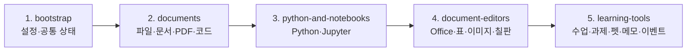

# JavaScript 파일별 기능 안내

**최종 업데이트: 2026년 8월 1일**

이 문서는 만능파일교실의 JavaScript 파일이 각각 어떤 기능을 담당하는지 빠르게 찾기 위한 유지보수용 색인입니다. 기능을 추가하거나 파일 책임이 바뀌면 해당 행과 날짜를 함께 갱신합니다.

## 가장 먼저 알아둘 점

- 앱 실행 코드의 원본은 `src/js/*.js`입니다.
- 실제 로딩 순서와 계층은 `scripts.manifest.json`이 기준입니다. 새 파일을 만들면 HTML에 태그만 추가하지 말고 manifest에도 등록해야 합니다.
- `manneung-classroom-offline.html`과 `desktop/app.html`은 생성 파일입니다. 직접 수정하지 않습니다.
- 수정 후 `node build-offline.js`를 실행하면 모든 로컬·vendor JS가 오프라인 HTML 하나로 합쳐집니다.
- 각 파일은 ES module이 아닌 전역 스크립트입니다. 이름 충돌과 로딩 순서가 중요하므로 `npm run check`로 전역 선언·의존성 계약을 확인합니다.
- 자동 생성 파일인 `src/js/korean-font.js`는 직접 수정하지 않습니다.

## 앱 로딩 구조



## 1. bootstrap — 초기 설정과 공통 기반

| 파일 | 담당 기능 | 주로 함께 확인할 파일 |
|---|---|---|
| `state-sync.js` | EXE의 포트가 바뀌어도 설정이 유지되도록 로컬 서버와 `localStorage`를 동기화합니다. 같은 출처 요청에 실행별 인증 토큰을 붙이고 종료 직전 상태도 전송합니다. | `desktop/launcher.cs`, `state.js` |
| `theme.js` | 문서가 그려지기 전에 저장된 다크·라이트 테마를 적용해 초기 화면 깜빡임을 막습니다. | `state.js`, `src/styles.css` |
| `i18n.js` | 한국어·영어 사전, 매개변수 번역, DOM 텍스트·title·aria 자동 번역과 언어 전환을 담당합니다. 사용자에게 보이는 새 문구를 추가하면 이 파일의 영문 사전도 확인합니다. | 모든 UI 파일, `app.js` |
| `lazy.js` | 무거운 vendor 라이브러리를 시작할 때가 아니라 그 형식을 열 때 처음 불러오는 지연 로더(`MNLazy`)입니다. 엑셀·한글·PPT·Word·압축·캡처·맞춤법 사전 묶음과 로드 순서(JSZip 2.6.1 ↔ 3.x 교체)를 정의하며, 단일 파일 빌드에서는 `text/plain` 블록을, 서버 서빙에서는 `vendor/` 스크립트를 씁니다. 새 vendor 를 추가하면 `scripts.manifest.json`의 `lazy` 값과 이 파일의 묶음을 함께 맞춥니다. | `scripts.manifest.json`, `build-offline.js`, `spreadsheet-viewer.js`, `office-doc-viewers.js`, `tests/release-contract.test.js` |
| `core.js` | 경로 정규화, 작업공간 마커, 인코딩 판별, Python 오류 설명·경로 분석, Markdown/HTML 살균, 코드 편집 순수 함수 등 여러 기능이 공유하는 기반 유틸리티 모음입니다. | `documents.js`, `python-run-context.js`, `tests/core.test.js` |
| `icons.js` | 앱의 이모지형 버튼을 테마에 맞는 단색 SVG 아이콘으로 정리하고 동적으로 추가되는 UI도 관찰해 보정합니다. | UI를 만드는 모든 파일 |
| `state.js` | 열린 문서·탭·사이드바·학습 화면의 전역 상태, 앱 설정과 단축키, 공용 토스트·로딩 UI를 관리합니다. | `documents.js`, `app.js`, `i18n.js` |
| `history.js` | 편집기 공용 되돌리기·다시실행(`MNEditHistory`)입니다. 스냅샷 스택·상한(개수·총량)·redo 무효화·버튼 상태·연속 입력 묶기를 담당하고, 각 편집기는 capture·apply·isEqual 만 넘깁니다. PDF·표·노트북·이미지·화이트보드·파이썬 편집기가 모두 씁니다. | `pdf-recovery.js`, `spreadsheet-viewer.js`, `notebook-model.js`, `image-viewer.js`, `whiteboard.js`, `python-editor.js`, `tests/edit-history.test.js` |
| `search-history.js` | 최근 검색어(`MNSearchHistory`)입니다. 검색어를 구획(통합검색·편집기·PDF·노트북·표·일괄바꾸기)별로 `localStorage`에 12개까지 보관하고, 찾기 창을 열 때 마지막 검색어를 채워 주고 '최근 검색어' 드롭다운을 그립니다. 기록은 Enter·다음/이전·바꾸기처럼 실제로 검색을 쓴 순간에만 남기며, 찾기 옵션(대소문자·단어·정규식)도 함께 기억합니다. 설정 → 일반에서 끄거나 한 번에 지울 수 있고, '바꿀 내용'은 기억하지 않습니다. 여러 파일을 한꺼번에 바꾸는 자리(시트 찾기·바꿈, 여러 파일 찾아 바꾸기)에서는 목록만 보여 주고 자동으로 채우지는 않습니다. | `app.js`(통합검색), `python-editor.js`(편집기·가벼운 찾기), `code-viewer.js`(대용량·실행 결과), `pdf-editor.js`, `notebook-tools.js`, `spreadsheet-viewer.js`, `batch-replace.js`, `tests/search-history.test.js` |
| `special-chars.js` | 특수문자 문자표(`MNSpecialChars`)입니다. 브라우저 위에서 도는 편집기라 한글의 "ㅁ + 한자키"가 오지 않으므로, 커서 자리에서 우클릭 → 특수문자(또는 Ctrl+F10)로 문자표를 열어 ※ ○ ① ㎡ 같은 글자를 넣습니다. 문장부호·괄호·수학·단위·일반기호·화살표·선/표·원문자·로마/그리스·분수·한글 자모·가나·키릴·라틴·그림문자 묶음을 한자키 자모(ㄱ·ㄴ·ㄷ…)와 함께 보여 주고, 종류(별·화살표·분수…)로 거르며, 최근 쓴 글자 20개를 `localStorage`에 기억합니다. Shift+클릭이면 문자표를 닫지 않고 이어서 넣습니다. 표 셀처럼 contenteditable 인 자리는 `python-editor.js`의 `attachEditableContextMenu`가 선택 Range 기준으로 같은 메뉴를 띄웁니다. | `python-editor.js`(우클릭 메뉴·Ctrl+F10), `mnote.js`(글 블록·표 셀), `scratchpad.js`(글 블록·표 셀), `spreadsheet-viewer.js`(편집 중 셀·수식 입력줄), `tests/special-chars.test.js` |
| `spellcheck.js` | 외부 API 없이 동작하는 한국어 맞춤법·띄어쓰기 규칙 엔진(`MNKoreanSpellcheck`)과 공통 검사 패널, 교정 후보 적용, 무시·사용자 사전, 한글 조합 안전 재검사를 담당합니다. 일반 문서는 전체 글을, 마크다운은 코드 구간을 제외하고, 코드 파일은 주석·문자열만 검사합니다. 확실한 규칙 검사에 더해, 3MB가 넘는 **hunspell 한국어 사전 워커**(`vendor/korean-hunspell-worker.js`)는 시작할 때 싣지 않고 검사를 처음 실행할 때 `MNLazy`로 불러와 낱말 단위 오탈자까지 봅니다(45초 안에 못 받아오면 규칙 검사 결과만 씁니다). | `lazy.js`, `code-viewer.js`, `notebook-cells.js`, `scratchpad.js`, `mnote.js`, `tools/build-korean-spell-worker.mjs`, `tests/spellcheck.test.js` |

## 2. documents — 파일, 문서, PDF와 코드 보기

| 파일 | 담당 기능 | 주로 함께 확인할 파일 |
|---|---|---|
| `pdf-recovery.js` | PDF 편집 복구본을 IndexedDB에 저장·복원하고 PDF 편집 Undo/Redo 히스토리를 관리합니다. | `pdf-editor.js`, `pdf-pages.js`, `tests/pdf-recovery.test.js` |
| `video-viewer.js` | 영상·오디오 재생, SRT/VTT/SMI 자막 변환·자동 연결, EXE 영상 변환과 폴더 일괄 MP4 변환을 담당합니다. | `file-loaders.js`, `desktop/launcher.cs`, `tests/video-subtitles.test.js` |
| `documents.js` | 문서 객체 생성, 탭·사이드바·그룹 트리, 활성 문서 전환, 검색, 분할 작업, 새로고침·닫기 등 다중 문서 생명주기의 중심입니다. 지원 확장자와 코드 프로파일도 정의합니다. 탭바는 파일이 하나만 열려 있어도 표시하고, 폴더·압축을 열 때 첫 파일을 자동으로 띄우지 않는 배치(`suppressUiBatchAutoOpen`)와 아무 문서도 없을 때의 빈 화면(`#docEmpty`) 전환도 여기서 관리합니다. | `state.js`, `file-loaders.js`, `viewer-base.js`, `tests/single-tab-and-auto-open.test.js` |
| `workspace-store.js` | 최근 작업공간을 서버 또는 IndexedDB에 바이너리로 저장·병합·삭제하고 재실행 시 파일·폴더·탭 상태를 복원합니다. | `file-loaders.js`, `desktop/launcher.cs`, `tests/folder-workspace.test.js` |
| `recent-files.js` | 최근 연 파일·폴더 목록(`MNRecent`)입니다. 목록은 `localStorage`에 두고, 다시 열 때는 이미 보관된 File System Access 핸들(`saveFsHandle`·`rememberFolderHandle`)을 찾아 권한 확인 1회로 되살립니다. 옮겨지거나 지워진 항목은 안내와 함께 목록에서 지울 수 있습니다. | `file-loaders.js`, `app.js`, `code-viewer.js`(핸들 보관), `tests/recent-files.test.js` |
| `file-loaders.js` | 파일·폴더·드래그 입력을 문서 종류별 로더로 전달합니다. 폴더 핸들, 빈 폴더, 새로고침, ZIP/TAR/GZ 해제, PPTX 변환 폴백을 관리합니다. | `documents.js`, `workspace-store.js`, 각 형식 뷰어 |
| `pdf-render.js` | PDF.js 문서 로딩, 페이지 자리표시자, 지연 캔버스 렌더링, 화질·배율·야간 모드와 한글 폰트 렌더링을 담당합니다. | `pdf-editor.js`, `pdf-pages.js`, `korean-font.js` |
| `pdf-ocr.js` | 스캔 PDF를 Tesseract로 OCR하고 결과를 문서 지문 기준으로 IndexedDB에 캐시해 PDF 검색과 사이드바 검색에 제공합니다. | `pdf-editor.js`, `documents.js`, `tests/lesson-ocr.test.js` |
| `pdf-editor.js` | PDF 확대·축소, 현재 페이지, 전체화면, 검색·강조, 서명·텍스트·날짜·체크·필기와 저장 UI를 담당합니다. | `pdf-render.js`, `pdf-pages.js`, `pdf-recovery.js` |
| `pdf-pages.js` | PDF 다운로드 바이트 생성, 책갈피 목차, 페이지 선택·추출·삭제·회전·순서 변경·합치기를 담당합니다. | `pdf-editor.js`, `pdf-recovery.js`, `tests/pdf-outline.test.js` |
| `viewer-base.js` | Office/텍스트 문서 로더의 공통 진입점입니다. Markdown, 일반 텍스트, HTML 상대 리소스, SQLite 읽기 전용 미리보기를 렌더합니다. | `office-doc-viewers.js`, `code-viewer.js`, `pptx-viewer.js` |
| `korean-font.js` | Pyodide Matplotlib용 NanumGothic gzip+base64 데이터입니다. 자동 생성 파일이므로 직접 수정하지 않습니다. | `python-runtime.js`, 생성 도구 |
| `code-viewer.js` | 코드·설정 파일의 구문 강조와 줄번호, Python 실행 바, `.py`·텍스트 저장, 원본 핸들/자동 저장 폴더 분기, 노트북 변환, 정의 이동 연결을 담당합니다. 실행 바의 **따라치기**(교본 위에 그대로 쳐 보는 타자 연습) 버튼과 진행률·정확도 표시, 편집 화면과 읽기 화면 양쪽의 **줄 번호로 이동(Ctrl+G)** 진입점도 여기서 답니다. | `python-editor.js`, `python-runtime.js`, `python-run-context.js` |

## 3. python-and-notebooks — Python 편집·실행과 Jupyter

| 파일 | 담당 기능 | 주로 함께 확인할 파일 |
|---|---|---|
| `python-snippets.js` | Python 예제 갤러리, 난이도·검색 필터, 예제 열기, 로컬 Python import 색인과 자동완성 후보 준비를 담당합니다. | `python-editor.js`, `desktop/launcher.cs` |
| `python-editor.js` | 자체 코드 편집기 UI를 만듭니다. 줄번호, 구문 강조, 자동 들여쓰기, 찾기·바꾸기, 자동완성, 다중 캐럿, 셀 경계, 오류 줄과 정의 이동을 관리합니다. 또한 **열 편집**(`Alt`+세로 드래그)의 사각 선택 오버레이와 그 전용 클립보드(복사·잘라내기·붙여넣기), **코드 따라치기** 엔진(교본 대조·오타 표시·진행률), **줄 번호로 이동 미니 창**, 우클릭 상황 메뉴(복사·대소문자 변환·선택한 줄 중복 제거·특수문자 `Ctrl+F10`)와 `contenteditable` 자리용 `attachEditableContextMenu`를 담당합니다. | `code-viewer.js`, `python-snippets.js`, `special-chars.js`, `tests/python-editor-word-select.test.js` |
| `python-run-context.js` | 함께 연 프로젝트 파일을 실행 번들로 구성하고 Python의 작업폴더·프로젝트 루트·상대경로·import·출력 파일 경로를 계산합니다. | `file-loaders.js`, `python-runtime.js`, `tests/python-path-helper.test.js` |
| `python-runtime.js` | Python 실행의 총괄입니다. EXE 로컬 Python과 브라우저 Pyodide를 선택하고 패키지 준비, 입력, 스트리밍 출력, 중지, 진단·단계 실행, 결과 파일 수집을 처리합니다. | `python-run-context.js`, `desktop/launcher.cs`, `korean-font.js` |
| `python-terminal.js` | Python 편집기의 결과/터미널 전환, 명령 기록·중지·초기화, EXE의 지속형 로컬 PowerShell 세션과 브라우저의 상태 유지 Pyodide 콘솔을 담당합니다. | `code-viewer.js`, `python-runtime.js`, `desktop/launcher.cs` |
| `notebook-model.js` | `.ipynb` 파싱·직렬화, 셀·출력 모델, 복구본·자동 저장, 실행 상태 해시, 셀 추가·삭제·이동 같은 DOM 비종속 모델 기능을 담당합니다. | `notebook-run.js`, `notebook-cells.js`, `tests/notebook-serialize.test.js` |
| `notebook-tools.js` | 노트북 실행 작업공간과 파일 번들, 로컬 셀 커널 선택·시작·중지, 로컬 Python 설치 안내와 커널 통신을 담당합니다. | `notebook-model.js`, `python-runtime.js`, `desktop/python_kernel.py` |
| `notebook-run.js` | 노트북 전체 화면과 상단 도구막대를 만들고 셀 렌더링, 전체 실행, 저장, 목차, 찾기, 출력 메뉴, 커널 상태 UI를 연결합니다. | `notebook-model.js`, `notebook-tools.js`, `notebook-cells.js` |
| `notebook-pdf-export.js` | 노트북을 A4 PDF로 내보냅니다. 셀 경계를 고려한 페이지 분할, 캔버스 배치, 지도·iframe 리치 출력 스냅샷을 처리합니다. | `notebook-run.js`, `tests/pdf-layout.test.js` |
| `notebook-cells.js` | 개별 코드·마크다운·Raw 셀 UI, 셀 실행·입력, 선택·복사·붙여넣기, 드래그 순서 변경, 접기, 메모 보내기와 셀 도구 버튼을 담당합니다. | `notebook-run.js`, `python-editor.js`, `scratchpad.js` |

## 4. document-editors — Office, 표, 이미지와 화이트보드

| 파일 | 담당 기능 | 주로 함께 확인할 파일 |
|---|---|---|
| `office-doc-viewers.js` | DOCX, HWP, HWPX의 읽기 전용 미리보기와 Office 암호화 문서 판별·복호화 보조를 담당합니다. | `viewer-base.js`, `file-loaders.js` |
| `spreadsheet-viewer.js` | XLSX/XLS/CSV 로딩과 시트 UI, 셀 편집·선택·복사, 수식 계산, 행/열·병합·서식·필터·정렬, 저장과 새 표 생성을 담당합니다. | `spreadsheet-chart.js`, `tests/xlsx-edit.test.js` |
| `spreadsheet-chart.js` | 선택한 표 범위에서 차트에 적합한 데이터를 추론하고 막대·선·원형 SVG 차트를 생성합니다. | `spreadsheet-viewer.js` |
| `pptx-viewer.js` | PPTX 간이 슬라이드 미리보기, 슬라이드 맞춤, 포함 폰트 변환과 상대 리소스 경로 해석을 담당합니다. EXE의 정확한 PDF 변환 실패 시 사용됩니다. | `file-loaders.js`, `office-doc-viewers.js` |
| `image-viewer.js` | 이미지 보기·확대·회전·뒤집기·자르기·내보내기, 작업공간 복구와 폴더 이미지/PDF 갤러리를 담당합니다. | `file-loaders.js`, `documents.js` |
| `image-lightbox.js` | 파이썬 실행 결과 그래프와 노트북 출력 그림을 클릭하면 큰 오버레이 창으로 띄우고 확대·이동·넘기기·PNG 저장·메모 보내기를 제공합니다. | `python-runtime.js`, `notebook-cells.js`, `image-viewer.js` |
| `board-render.js` | 화이트보드와 수업 리플레이가 공유하는 선·도형·텍스트·이미지 벡터 렌더러입니다. | `whiteboard.js`, `lesson-replay.js` |
| `whiteboard.js` | 독립 화이트보드 문서, 그리기 도구, 선택·이동, 이미지, Undo/Redo, 복구 저장과 리플레이 녹화 연결을 담당합니다. | `board-render.js`, `lesson-replay.js` |

## 5. learning-tools — 수업, 과제, 펫, 메모와 앱 이벤트

| 파일 | 담당 기능 | 주로 함께 확인할 파일 |
|---|---|---|
| `lesson-replay.js` | `.lesson` 데이터 검증, 화이트보드·PDF·Python 이벤트 녹화, 타임라인 재생·탐색·속도 조절과 파일 저장을 담당합니다. | `board-render.js`, `whiteboard.js`, `code-viewer.js` |
| `diff-viewer.js` | 파일 비교(diff) 문서: patience diff 자체 구현, 나란히/한 줄 보기, 공백 무시·접기, 두 파일 선택 모달과 저장본 비교, 과제 시작 코드 비교 진입점을 담당합니다. | `documents.js`, `task-package.js`, `command-palette.js`, `tests/diff-viewer.test.js` |
| `batch-replace.js` | 여러 파일 찾아 바꾸기: 열린 텍스트·코드 문서에서 한꺼번에 찾아 바꾸기(대소문자·정규식·그룹 치환), 미리보기 체크리스트, `saveTextDoc({silent,existingOnly})`로 조용히 저장, 되돌리기를 담당합니다. | `documents.js`, `code-viewer.js`, `command-palette.js`, `tests/batch-replace.test.js` |
| `task-package.js` | `.task` 과제 만들기·검증·내보내기, `.taskdone` 제출본 생성·검수·재채점, 일괄 검수와 성적 CSV를 담당합니다. | `python-runtime.js`, `file-loaders.js`, `tests/task-package.test.js` |
| `screensaver.js` | 유휴 화면 시계·영상 재생, 영상 목록 IndexedDB 저장, 재생 가능성 검사와 전체화면 종료를 담당합니다. | `app.js`, `state.js` |
| `pet-data.js` | 픽셀 펫 종족별 스프라이트, 팔레트, 이름과 기본 대사를 정의합니다. | `pet.js`, `pet-custom.js` |
| `pet-custom.js` | 펫 대사 편집, 사용자별 종족 대사, 나만의 펫 외형 조합과 저장·복원을 담당합니다. | `pet-data.js`, `pet.js` |
| `pet-events.js` | 펫 행동 도감의 고유 이벤트 이름과 한국어·영어 설명을 정의합니다. | `pet.js`, `tests/pet-events.test.js` |
| `pet.js` | 픽셀 펫의 이동·점프·플랫폼 탐색·행동·대사·드래그·이벤트 도감과 실제 DOM 애니메이션 엔진입니다. | `pet-data.js`, `pet-custom.js`, `pet-events.js` |
| `pet-focus.js` | 집중·휴식 타이머, 오늘 완료 횟수, 타이핑 중 조용한 상태와 집중 모드에 따른 펫 행동을 관리합니다. | `pet.js`, `state.js`, `tests/pet-focus.test.js` |
| `scratchpad.js` | 여러 탭 임시 메모, 글·이미지·표·노트북 셀 블록, 배치·크기·잠금·드래그 순서·자동 저장·이전 형식 마이그레이션을 담당합니다. | `notebook-cells.js`, `image-memo.js`, `tests/scratchpad.test.js` |
| `mnote.js` | 글·이미지·표 블록을 한 문서에서 편집하고 `.mnote` JSON으로 저장·재편집하며, 내용 검색 이동·되돌리기·HTML/Markdown 내보내기를 담당합니다. | `documents.js`, `file-loaders.js`, `code-viewer.js`, `history.js`, `spellcheck.js`, `tests/mnote.test.js` |
| `image-memo.js` | 캡처 이미지 여러 장 붙여넣기·드롭, EXE 자동 저장, 브라우저 임시 복구, 다시 시도·삭제·미리보기·일반 메모 보내기를 담당합니다. | `scratchpad.js`, `desktop/launcher.cs`, `tests/image-memo.test.js` |
| `backup.js` | 미저장 작업·메모·복구 데이터와 설정을 전용 매니페스트가 든 ZIP으로 내보내고, 형식·버전·필수 구조를 검증해 IndexedDB·localStorage·작업공간으로 복원합니다. | `workspace-store.js`, 각 편집기 복구 훅, `tests/backup.test.js` |
| `app.js` | 최종 이벤트 배선 파일입니다. 드래그 앤 드롭, 파일/폴더 열기, 설정 모달, 자동 저장 폴더, 도움말, 단축키, 헤더 메뉴, 서버 heartbeat와 앱 시작·종료 흐름을 연결합니다. | 사실상 모든 기능 파일, 특히 `state.js`, `file-loaders.js` |
| `command-palette.js` | `Ctrl+K` 명령 팔레트의 명령 목록, 현재 문맥별 활성화 조건, 검색·키보드 선택과 실제 기능 호출을 담당합니다. | `app.js`, 각 명령 대상 파일 |

## 빌드·개발 도구 JS

이 파일들은 앱 화면에 로드되지 않고 개발·배포 과정에서 실행됩니다.

| 파일 | 담당 기능 |
|---|---|
| `build-offline.js` | `manneung-classroom.html`, `src/styles.css`, manifest의 로컬 JS와 vendor 자산을 하나의 `manneung-classroom-offline.html`로 합치고 무결성을 확인합니다. |
| `playwright.config.js` | Playwright E2E 테스트의 서버·브라우저·테스트 경로를 설정합니다. |
| `tools/check-source.js` | JavaScript 문법, 전역 선언 충돌, manifest 로딩 계층과 공개 API 경계를 검사합니다. |
| `tools/check-release.js` | 오프라인 HTML에 로컬 경로가 남지 않았는지, vendor 파일·해시와 배포 산출물이 올바른지 확인합니다. |
| `tools/download-pyodide.js` | EXE의 오프라인 Python 실행에 필요한 Pyodide 코어·패키지를 내려받아 `vendor/pyodide`를 구성합니다. |
| `tools/build-korean-spell-worker.mjs` | `hunspell-wasm`·`hunspell-dict-ko`를 esbuild로 묶어 맞춤법 사전 워커 `vendor/korean-hunspell-worker.js`를 만들고 `scripts.manifest.json`의 sha384도 함께 갱신합니다. `npm run build`가 오프라인 HTML을 만들기 전에 먼저 실행합니다. |
| `tools/e2e-server.js` | Playwright 테스트용 로컬 정적 서버입니다. 실제 EXE 백엔드를 대신해 화면 흐름 테스트에 필요한 파일을 제공합니다. |
| `tools/recolor-calico-sprites.js` | 픽셀 펫 복실고양이 스프라이트 시트를 삼색고양이 배색으로 리컬러하는 1회성 자산 도구입니다(앱에 로드되지 않음). |

## 테스트 JS

`npm test`는 `tests/*.test.js`(Node 내장 러너)를, `npm run test:e2e`는 `tests/e2e/*.spec.js`(Playwright)를 실행합니다.

### 단위·계약 테스트 (`node --test`)

| 파일 | 검사 범위 |
|---|---|
| `tests/backup.test.js` | 전용 백업 매니페스트·버전 거부와 내보내기·복원 메뉴 연결 |
| `tests/batch-replace.test.js` | 여러 파일 찾아 바꾸기: 정규식 이스케이프·대소문자·그룹 치환·줄 단위 변경 기록·위험 패턴 거부 |
| `tests/binary-model-extension.test.js` | 학습 모델·NumPy 이진 파일의 안전 보관 경로와 Word2Vec 텍스트 내보내기 검색 등록 |
| `tests/board-render.test.js` | 화이트보드 공용 렌더러의 선택 판정과 항목 이동 좌표 계산 |
| `tests/content-search-live-text.test.js` | 사이드바 내용 검색이 저장 전 편집기 내용을 보는지, 깨끗한 문서는 `savedText`를 쓰는지 |
| `tests/core.test.js` | 공통 경로·인코딩·Markdown·코드 편집·Python 분석 등 `core.js` 중심 순수 함수 |
| `tests/diff-viewer.test.js` | 파일 비교 diff 판정·chg 짝짓기·인라인 강조·접기·행 HTML 이스케이프 |
| `tests/doc-legacy.test.js` | 구형 `.doc`(Word 97) 조각표에서 유니코드·CP1252 본문을 문단으로 뽑는 파서 |
| `tests/document-edge-shortcuts.test.js` | `Ctrl+Home`/`Ctrl+End`의 편집기·노트북(첫 셀 시작·마지막 셀 끝) 동작 |
| `tests/document-enhancements.test.js` | 표시 이름, 문서 복구 스냅샷, 검색·편집기 보강 계약 |
| `tests/e2e-contract.test.js` | E2E 설정과 필수 시나리오가 유지되는지 확인하는 계약 테스트 |
| `tests/folder-new-document.test.js` | 폴더 안 새 문서의 문맥 상속(부모·묶음·상대경로)과 이름 충돌 시 번호 붙이기 |
| `tests/folder-workspace.test.js` | 폴더 저장·복원·새로고침, 자동 저장 폴더 UI, 원본 미저장 안내와 설명서 주의사항 |
| `tests/image-memo.test.js` | 이미지 메모 파일명·자동 저장·임시 복구 조건 |
| `tests/ink-toolbar-icons.test.js` | 필기·표시 도구막대가 이모지 대신 공용 SVG 아이콘을 쓰는지 |
| `tests/lesson-ocr.test.js` | `.lesson` 검증과 OCR 캐시 문서 식별 |
| `tests/local-server-security.test.js` | EXE 로컬 API 인증·경로 검증·보안 헤더·실행 상한 |
| `tests/mnote.test.js` | `.mnote` 직렬화 안정성, 지원하지 않는 버전·블록 거부, 블록 본문 검색 규칙 |
| `tests/native-folder-terminal.test.js` | EXE 폴더 열기의 실제 경로 전달과 Windows Shell 직접 호출 |
| `tests/notebook-serialize.test.js` | ipynb 모델 왕복, 셀·출력·첨부·히스토리·자동 저장·커널 UI |
| `tests/notebook-workspace-path.test.js` | 노트북 작업폴더와 출력 파일 경로 |
| `tests/pdf-export-tab-switch.test.js` | PDF 저장 중 탭을 바꿔도 저장 대상 문서가 바뀌지 않는지 |
| `tests/pdf-layout.test.js` | PDF 숨김·분할 화면의 폭과 레이아웃 계산 |
| `tests/pdf-markup.test.js` | PDF 편집 표시와 명령 팔레트 접근성 연결 |
| `tests/pdf-outline.test.js` | PDF 책갈피 생성·계층·페이지 변경 보정 |
| `tests/pdf-pending-edits.test.js` | "저장하지 않은 PDF 편집" 판정(회전만 해도 편집으로 봄) |
| `tests/pdf-recovery.test.js` | PDF 자동 복구 차이 판별과 적용 |
| `tests/pet-custom-priority.test.js` | 사용자 펫 설정 우선순위 |
| `tests/pet-events.test.js` | 행동 도감 데이터와 종족 참조 무결성 |
| `tests/pet-fluffy-cat.test.js` | 복실고양이 전용 24프레임 시트와 주사율 무관 시간 배율 |
| `tests/pet-focus.test.js` | 집중 타이머 저장·복원과 UI 계약 |
| `tests/pet-fullscreen.test.js` | 문서 전체화면 중 펫을 전체화면 요소 안에 붙이는 호스트 선택 |
| `tests/pet-human.test.js` | 사진 기반 사람 펫의 전용 프레임과 스프라이트 오프라인 빌드 포함 |
| `tests/pet-notification.test.js` | 펫이 알림을 말풍선으로 대신 말할 때의 선택·덮어쓰기 규칙 |
| `tests/pet-quiet-corner.test.js` | 조용히 기다리는 자리(기본 좌우 번갈아 / 끌어다 놓은 코너) |
| `tests/pet-sky-island.test.js` | 천공의 섬 전용 스프라이트와 나만의 펫으로 저장했을 때의 유지 |
| `tests/python-autosave.test.js` | Python 자동 저장 기본 꺼짐과 예전 설정 이름 이어받기 |
| `tests/python-definition-view.test.js` | 외부 Python 정의를 읽기 전용 분할 뷰어로 여는 경로 |
| `tests/python-editor-completion.test.js` | 자동완성 닫기·응답 무효화와 주석 안 억제 |
| `tests/python-editor-jump-down.test.js` | 문서 끝 빈 줄 추가와 블록 여는 줄 뒤의 들여쓰기 유지 |
| `tests/python-editor-word-select.test.js` | 선택 없이 커서만 단어 안에 있을 때의 `F3` 단어 선택 |
| `tests/python-indirect-path.test.js` | import된 모듈의 상대 출력 폴더까지 실행 묶음에 포함 |
| `tests/python-kernel.test.js` | 로컬 노트북 커널의 셀 간 상태 유지(환경에 따라 제외 가능) |
| `tests/python-light-format.test.js` | 8칸 탭 스톱 기준 선행 탭 변환과 혼합 들여쓰기 깊이 보존 |
| `tests/python-live-diagnostics.test.js` | 실시간 진단의 입력 묶기·최신 결과 반영과 심각도 표시 |
| `tests/python-local-detect.test.js` | 로컬 파이썬 탐색(PATH·레지스트리·표준 폴더)과 Store 가짜 실행 파일 걸러내기 |
| `tests/python-notebook-split.test.js` | Python 코드를 노트북 셀로 나누는 규칙 |
| `tests/python-output-find.test.js` | 실행 결과·터미널 헤더에 검색 바를 다시 붙이는 규칙 |
| `tests/python-path-helper.test.js` | Python 실행 경로 도우미와 작업공간 번들 |
| `tests/python-pip-install-progress.test.js` | 패키지 설치 진행 라벨 축약과 경과 시간 표시 |
| `tests/python-stderr-classify.test.js` | Python 경고·실패 stderr 분류 |
| `tests/python-syntax-highlighting.test.js` | 데코레이터·정의 함수명·async·f-string 등 전용 토큰 강조 |
| `tests/recent-files.test.js` | 최근 목록 정렬·중복 승격과 같은 이름 다른 경로 구분 |
| `tests/release-contract.test.js` | vendor 고정본, manifest 로딩·의존성·공개 API 및 이 문서의 JS 목록 완전성 |
| `tests/scratch-save-name.test.js` | 첫 저장 이름 지정 시 확장자·폴더 경로 유지 |
| `tests/scratchpad.test.js` | 임시 메모 데이터 이전, 블록·잠금·노트북 셀 처리 |
| `tests/search-history.test.js` | 최근 검색어 구획 분리·상한·옵션 기억과 자동채움 정책 |
| `tests/shortcut-migration.test.js` | 새 기본 단축키의 충돌 회피와 예전 조합 사용자만 1회 이전 |
| `tests/single-tab-and-auto-open.test.js` | 파일 하나만 열려도 탭바 표시, 폴더·압축 첫 파일 자동 열기 억제와 빈 화면 |
| `tests/special-chars.test.js` | 특수문자 문자표 묶음·한자키 자모 대응·최근 사용 기록 |
| `tests/spellcheck.test.js` | 오프라인 한국어 규칙, 마크다운 코드 제외, 코드 주석·문자열 범위, 사용자 사전과 화면 연결 |
| `tests/sqlite-editor-safety.test.js` | SQLite 편집을 서버가 확인한 디스크 경로에서만 여는 안전 조건 |
| `tests/study-mode.test.js` | 분할 작업 선택·참고 잠금·모바일 배치·상태 복원 |
| `tests/tab-dirty-indicator.test.js` | 수정 상태의 보이는 탭·숨겨진 탭 반영과 닫기 버튼 접근성 |
| `tests/task-package.test.js` | 과제·제출본 경로 충돌, 검증과 재채점 대상 선택 |
| `tests/theme-background.test.js` | 라이트 배경 설정 저장·초기 적용·CSS 계약 |
| `tests/tokens-extension.test.js` | `.tokens` 파일의 일반 텍스트 문서 등록 |
| `tests/tool-visibility.test.js` | 도구막대 버튼 노출·숨김 레지스트리와 필수 버튼 제외 규칙 |
| `tests/unknown-text-extension.test.js` | 모르는 확장자의 텍스트 판별 후 허용과 이진 파일 거부 |
| `tests/ux-p0.test.js` | 시작 화면 기본 행동과 원본·사본 저장 대상 안내 |
| `tests/video-subtitles.test.js` | 자막 변환·자동 연결과 영상 작업공간 제외 |
| `tests/xlsx-edit.test.js` | 표 편집, 수식, 병합, 행·열, 차트와 XLSX 저장 왕복 |

### 화면 흐름 테스트 (Playwright, `tests/e2e/*.spec.js`)

| 파일 | 검사 범위 |
|---|---|
| `tests/e2e/critical-flows.spec.js` | 파일 열기·탭 전환·저장 등 핵심 사용자 흐름 |
| `tests/e2e/autosave-and-recovery.spec.js` | 설정 창의 자동 저장 항목 묶음, 예전 설정 이어받기, 조용한 저장 |
| `tests/e2e/code-practice.spec.js` | 코드 따라치기 시작·오타 표시·그만두기 |
| `tests/e2e/column-clipboard.spec.js` | 열 편집 사각 선택의 복사·잘라내기·붙여넣기 |
| `tests/e2e/column-edit-font.spec.js` | 고정폭·가변폭 글꼴에서 열 편집이 가리킨 경계에 정확히 놓이는지 |
| `tests/e2e/dirty-indicator.spec.js` | 편집·되돌리기에 따라 상단 배지와 사이드바 표시가 함께 켜지고 꺼지는지 |
| `tests/e2e/doc-legacy.spec.js` | 구형 `.doc` 열기와 글자 미리보기 화면 |
| `tests/e2e/goto-line.spec.js` | `Ctrl+G` 줄 이동 창과 실제 이동 |
| `tests/e2e/lazy-vendor.spec.js` | 무거운 vendor 라이브러리를 형식을 열 때만 불러오는지 |
| `tests/e2e/mouse-side-buttons.spec.js` | 마우스 옆 버튼의 앞·뒤 문서 이동 |
| `tests/e2e/notebook-undo.spec.js` | 노트북 셀 작업 되돌리기·다시 실행 |
| `tests/e2e/palette-coverage.spec.js` | 문맥별 팔레트 항목 노출과 사용법 문서·도움말 진입점 |
| `tests/e2e/pet-fullscreen.spec.js` | 문서 전체화면에서 픽셀 펫 표시 |
| `tests/e2e/recent-files.spec.js` | 최근 연 항목 목록과 다시 열기 |
| `tests/e2e/save-target-badge.spec.js` | 원본 저장/사본 저장 배지와 상단 안내 표시 |
| `tests/e2e/search-history.spec.js` | 찾기·검색창의 최근 검색어 채움과 드롭다운 |
| `tests/e2e/sidebar-overlay.spec.js` | 파일을 열 때 사이드바가 본문 위에 뜨는 서랍 동작과 접힘 상태 기억 |
| `tests/e2e/sidebar-selection.spec.js` | 사이드바 다중 선택과 선택 기반 동작 |
| `tests/e2e/spreadsheet-undo.spec.js` | 표 편집 되돌리기·다시 실행 |
| `tests/e2e/tab-drag-split.spec.js` | 탭 드래그 순서 변경과 분할 작업 진입 |
| `tests/e2e/undo-redo.spec.js` | 화이트보드 획 되돌리기·다시실행과 redo 기록 무효화, 단축키 |

## 기능을 찾을 때 빠른 기준

| 하려는 작업 | 먼저 볼 파일 |
|---|---|
| 새 파일 형식 지원 | `documents.js` → `file-loaders.js` → 해당 뷰어 |
| 탭·사이드바·분할 작업 | `documents.js`, `state.js` |
| 최근 작업공간·폴더 복원 | `workspace-store.js`, `file-loaders.js` |
| `.py` 편집·저장 버튼 | `code-viewer.js`, `python-editor.js` |
| Python 실행 결과·패키지 | `python-runtime.js`, `python-run-context.js` |
| Python 편집기 터미널 | `python-terminal.js`, `desktop/launcher.cs` |
| Jupyter 셀 UI | `notebook-run.js`, `notebook-cells.js`, `notebook-model.js` |
| 파일 비교(diff)·여러 파일 찾아 바꾸기 | `diff-viewer.js`, `batch-replace.js`, `command-palette.js` |
| 블록 문서(`.mnote`) | `mnote.js`, `documents.js`, `file-loaders.js` |
| 찾기 창·최근 검색어·특수문자 | `search-history.js`, `special-chars.js`, 각 편집기 |
| 단축키 정의·기본값 | `state.js`(`SHORTCUT_DEFINITIONS`), `app.js`(설정 화면) |
| 설정창·전역 이벤트 | `app.js`, `state.js` |
| 사용자 문구·영문 번역 | `i18n.js` |
| EXE API·실제 디스크 저장 | JS가 아니라 `desktop/launcher.cs` |
| 오프라인 HTML/EXE 재생성 | `build-offline.js`, `desktop/build.bat` |

## 계속 업데이트하는 방법

1. 파일의 책임이 바뀌면 위 표의 설명과 **최종 업데이트 날짜**를 수정합니다.
2. 새 `src/js` 파일을 추가하면 `scripts.manifest.json`의 알맞은 계층과 이 문서에 모두 등록합니다.
3. 사용자에게 보이는 문구가 생기면 `i18n.js` 영문 사전을 확인합니다.
4. 관련 `tests/*.test.js`를 추가하거나 기존 계약 테스트를 갱신합니다.
5. 다음 명령으로 검증합니다.

```powershell
npm.cmd run verify        # check → test → build(맞춤법 워커+오프라인 HTML) → release-check
desktop\build.bat         # exe 재생성
npm.cmd run test:e2e      # 필요할 때 Playwright 화면 흐름 테스트
```

`tests/release-contract.test.js`는 manifest에 등록된 모든 `src/js` 파일명이 이 문서에 있는지 확인하므로, 새 파일을 추가하고 문서 갱신을 잊으면 테스트가 실패합니다.
