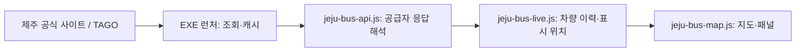

# 제주 버스 실시간 지도 설계

작성: 2026-09-12 · 상태: **TAGO 공급자로 전환(2026-09-16)**

## TAGO 전환 (2026-09-16)

- 제주 사이트 응답 대신 공공데이터포털의 TAGO 버스노선정보·버스위치정보로 바꿨다. 제주 사이트 공급자는 남기지 않았다(자동 대체 없음).
- 런처 조회: 노선 검색 `BusRouteInfoInqireService/getRouteNoList`, 정류장 `getRouteAcctoThrghSttnList`, 위치 `BusLcInfoInqireService/getRouteAcctoBusLcList`. 호스트 `https://apis.data.go.kr/1613000/` 고정, `_type=json`.
- 제주 도시코드는 처음 조회할 때 `getCtyCodeList`에서 이름에 "제주"가 든 항목을 찾아 기억하고, 못 찾으면 39를 쓴다(연결 실패면 기억하지 않는다).
- TAGO는 오류도 HTTP 200 본문 `resultCode`로 준다. 00 정상·03 자료 없음만 통과시키고, 22는 한도(`bus-quota`, 30분 대기), 20·30·31·32 및 게이트웨이 XML·401·403은 키 문제(`bus-key-invalid`)로 읽는다. 런처는 키 문제를 428, 한도를 429로 돌려주고 본문에 까닭을 싣는다. 키·한도 문제일 때는 낡은 위치로 덮지 않는다.
- 응답 봉투 함정: 한 건이면 `item`이 객체, 없으면 `items`가 빈 문자열. `routeno`는 숫자로 올 수 있다. 좌표 빈 문자열은 `Number("")=0`이 되므로 먼저 거른다.
- 번호 검색은 그 숫자가 들어간 노선을 모두 준다. 화면은 번호가 정확히 같은 노선이 있으면 그것만, 없으면 전부 보인다.
- TAGO에는 도로 경로(`shape`)가 없다. `/jeju-bus-shape`를 없애고, 이동 효과는 쓰지 않는다(옮겨 놓기). 정류장 순서를 옅은 점선으로만 잇는다. `jeju-bus-live.js`의 경로 보간 코드는 다른 공급자를 위해 그대로 둔다.
- 인증키: 설정 → 버스 실시간. 지하철 키와 같은 구조(`/tago-key-status`·`POST /tago-key?remember=`·`DELETE /tago-key`, DPAPI `%LOCALAPPDATA%\ClassDock\tago-key.bin`). 인코딩 키(%가 든 것)는 그대로, 디코딩 키는 이스케이프해서 보낸다. 키를 바꾸거나 지우면 조회 캐시를 비운다. 연결 시험은 노선 검색만 부르므로, 버스위치정보를 활용신청하지 않은 키는 지도에서 '키가 맞지 않아요'로 드러난다.
- 목록 최신화: 번호 없이 한 번 물어(최대 5쪽×1000건) 충분하면 끝, 모자라거나 거절되면 1~9로 나눠 묻는다. 상태의 `total`은 10단계. 1~1499를 하나씩 묻던 방식은 하루 한도를 넘기므로 버렸다.
- 실제 키로는 검증하지 못했다(이 컴퓨터에 키 없음). 제주 노선의 좌표 포함 여부·routeId 모양·번호 없는 조회 허용 여부는 키를 넣고 확인해야 한다.

## 1차 시범 구현 결과 (2026-09-12, 제주 사이트 공급자 — 위 전환으로 대체됨)

- 제주 사이트 공급자로 노선 검색·정류장·노선 경로·위치 조회를 연결했다. 키 입력 없이 EXE에서 사용한다. TAGO 공급자 전환은 후속 범위다.
- 지도 UI는 새 `src/js/jeju-bus-map.js`로 분리하고 기존 `map-viewer.js`에서 장착·캡처 연결만 담당한다.
- 실제 201번 경로의 중복 점을 제거한 2,554개 좌표 중 500m를 넘는 이음새 두 곳은 연결하지 않고 3개 구간으로 나눈다. 같은 구간의 정상 변경은 1.8초 동안 이어 표시한다. 실측 3202 차량의 첫 이동이 경로에 연결됨을 코드로 확인했다.
- 캐시 시각 보존, 부분 누락, 반복 좌표, 늦은 응답, 지도 숨김·종료, 캡처 고정과 실패 후 복원을 단위 테스트로 검증했다. 전체 단위 테스트 2,330개 및 소스 검사가 통과했다. UI 자동화·화면 캡처는 실행하지 않았다.
- `npm run build`와 `desktop/build.bat`으로 오프라인 HTML 및 `ClassDock.exe`를 생성했다. 실행 중인 기존 ClassDock 프로세스는 없었다.
- 빌드된 EXE 조회 함수를 호출하여 201번 세부 노선 20개, 선택 노선 정류장 186개, 원본 경로 좌표 3,717개, 해당 조회 시점 차량 3대를 받았다. 연속 호출에서 본문과 원본 수신시각이 같은 캐시 응답임을 확인했다. 검증 로그는 `.tmp/jeju-bus-launcher-smoke.json`에 있다.
- 기본 C# 런처에 구현했다. Go 폴백 런처에서는 기능 지원 프로브가 응답하지 않으므로 버튼을 비활성 상태로 표시한다.

## 1. 목표와 1차 범위

ClassDock 지도에서 제주 버스 노선을 선택하고 운행 차량의 위치 변화를 볼 수 있게 한다. 기존 Leaflet 지도, EXE 런처의 통신 중계, 실시간 층의 생명주기 구조를 활용한다.

1차는 **노선 하나 선택 → 차량 위치·노선번호 표시 → 좌표 변경 시 짧은 이동 효과**까지 구현한다. 정류장과 마지막 수신 상태를 함께 표시한다. 노선 경로를 확보·검증한 경우에만 도로를 따라 이동 효과를 적용한다.

제주 전역 모든 버스 동시 조회, 도착시간 예측, 차량의 미래 위치·속도 추정, 카카오맵 초정밀 버스 수준의 연속 추적은 후속 범위다. 실시간 기능은 인터넷이 연결된 EXE 실행 환경을 기준으로 한다.

## 2. 직접 확인한 데이터와 한계

2026-09-12 12:34:16~12:35:55 KST, 제주 공식 버스정보 사이트의 201번 세부 노선 `405320111`을 5회 조회했다. 응답에는 차량 5대가 있었고 그중 3대의 좌표가 변경됐다.

| 차량번호 끝자리 | 관측 결과 | 설계에 반영할 점 |
| --- | --- | --- |
| 3202 | 좌표 3종, 태흥3리사무소 → 어촌계입구 → 태흥초등학교 | 차량 ID를 유지하며 좌표를 갱신할 수 있음 |
| 3093 | 좌표 2종, 첫 좌표와 마지막 좌표 간 약 812m | 일정 시간 같은 좌표가 반복될 수 있음 |
| 3229 | 좌표 2종, 첫 좌표와 마지막 좌표 간 약 2.73km | 큰 좌표 변경을 실제 주행속도로 해석하면 안 됨 |
| 3077 | 좌표는 동일, 정류장 이름은 변경 | 정류장 정보와 좌표의 갱신이 일치하지 않을 수 있음 |
| 3097 | 관측 기간 좌표·정류장 변화 없음 | 정차와 데이터 지연을 응답만으로 구별할 수 없음 |

거리는 두 좌표 사이 직선거리이며 실제 주행거리나 실측 속도가 아니다. 단일 노선의 약 100초 표본으로 전체 지역의 정확도·갱신 주기를 확정하지 않는다. 원본 응답에 차량 위치의 측정시각은 없었다.

관측 자료: `../.tmp/jeju-bus-check-20260912/comparison.json`, `sample-1.json`~`sample-5.json`, `route.json`. `.tmp` 자료는 영구 테스트 자료가 아니므로 구현 시 필요한 최소 사례를 테스트 fixture로 옮긴다.

## 3. 데이터 연결 방식

### 1차 시범 연결: 제주 공식 사이트 응답

실제 좌표 변화를 확인한 경로로 시범 기능을 만든다. 현재 조회에는 인증키가 필요하지 않았다. 사이트에서 사용하는 조회 경로이므로 외부 개발자용 공개 API의 안정성이나 이용 범위가 보장된다고 간주하지 않는다. 정식 배포 전 제공 방식과 이용 조건을 확인하며, 의존 코드는 공급자별 어댑터에 한정한다.

| 용도 | 확인한 원격 경로 | 요청 |
| --- | --- | --- |
| 노선 검색 | `/data/search/searchSimpleLineListByLineNum` | POST, `keyword` |
| 정류장 목록 | `/data/search/getLineInfoByLineId` | POST, `lineId` |
| 버스 위치 | `/data/search/getRealTimeBusPositionByLineId` | POST, `lineId` |
| 노선 경로 후보 | `/data/search/getLinkInfoByLineId` | POST, `lineId` |

호스트는 `https://bus.jeju.go.kr`로 고정한다. 앞 세 경로는 실제 응답을 확인했다. 노선 경로는 사이트 소스에서 사용을 확인했지만 좌표 품질·방향·누락은 아직 검증하지 않았다.

### 후속 공식 API 연결: TAGO

TAGO 버스위치정보·버스노선정보를 별도 공급자로 연결할 수 있도록 설계한다. 제주 사이트 노선 ID와 TAGO 노선 ID가 같다고 가정하지 않는다. 도시코드와 노선 ID는 TAGO에서 조회한다.

활용신청 후 제주 노선의 좌표 포함 여부, 측정시각, 실제 갱신, 누락·호출 한도를 검증해 기본 공급자를 결정한다. 검증 전에는 자동 대체하지 않는다. 공급자를 바꾸면 기존 노선 선택과 차량 이력을 초기화한다.

## 4. 사용자 화면

지도 도구막대의 `🚌 제주 버스`를 누르면 노선 선택 패널을 연다. 버스 표시가 켜진 상태에서 다시 누르면 조회·버스·노선 표시를 끄고 패널도 닫는다. 패널에는 별도의 끄기 버튼을 두지 않는다. 패널의 닫기는 패널만 접는다.

```text
[🚌 제주 버스]
  노선번호 [201       ] [검색]
  201 · 제주 → 서귀포 · 세부 운행 경로
  201 · 서귀포 → 제주 · 세부 운행 경로
  [지도에 표시]

201 · 서귀포 방면 · 버스 5대 · 마지막 수신 12:35:55
```

### 노선번호 목록(2026-09-16 추가)

노선 검색은 번호가 정확히 같아야만 찾아 준다. `2`, `20`, 빈 문자열은 모두 빈 결과이고, 전체 노선 목록을 주는 경로는 찾지 못했다. 그래서 번호를 모르는 사람을 위해 목록을 앱에 넣어 두고(`src/js/jeju-bus-routes-data.js`) 패널 위쪽 셀렉박스로 고르게 한다. 고르면 검색칸이 채워지고 곧바로 기존 검색 흐름을 탄다. 번호를 직접 입력하는 칸은 그대로 둔다 — 목록에 없는 번호도 찾을 수 있어야 한다.

2026-09-16에 TAGO 노선 검색으로 받은 목록(번호 252개·세부 노선 992개)으로 바꿨다. 제주 사이트 시절 목록(151개·739개)은 정수 번호만 물어 만들어 `43-1`·`202-1` 같은 하이픈 번호와 3001~3008·5001~5006이 빠져 있었다. 아래는 그 시절 기록이다. 처음 목록은 1~1499번을 하나씩 물어 만들었다. 2026-09 확인 결과 101~1113번이 쓰이고 1200번 위로는 없었다(151개 번호·739개 세부 노선). 이 검색 응답은 `busTypeStr`을 비워 주므로 급행·간선 같은 이름으로 묶지 않고 백 단위(100번대·200번대…)로만 묶는다.

최신화는 사용자가 `목록 최신화`를 눌렀을 때만 런처가 돈다. 화면(JS)이 번호마다 `/jeju-bus-routes`를 부르면 100개 상한인 검색 캐시가 통째로 밀려나고 탭을 닫으면 끊기므로, 런처가 캐시를 거치지 않는 별도 작업으로 한 번에 하나씩(요청 사이 0.3초) 돈다. 결과는 포트가 바뀌어도 남도록 `%LOCALAPPDATA%\ClassDock\jeju-bus-routes.json`에 저장한다. 403·429·503이 오면 더 두드리지 않고 멈추고, 한 번호에서 세 번 실패하면 중단한다. 찾은 번호가 앱에 넣어 둔 목록의 절반보다 적으면 저장하지 않는다. 멈추거나 실패하면 예전 목록을 그대로 쓴다.

- 같은 번호의 세부 노선을 묶어 하나로 조회하지 않는다. 출발·종점과 제공되는 경유 정보로 구별하고, 여전히 같은 항목에는 정류장 목록 미리보기를 제공한다. 내부 ID를 기본 표시명으로 쓰지 않는다.
- 첫 표시 시에만 선택 노선 또는 유효한 차량·정류장 영역으로 지도를 이동한다. 새 응답마다 사용자의 지도 위치를 바꾸지 않는다. `노선 전체 보기`로 다시 이동할 수 있다.
- 차량에는 작은 버스 아이콘과 노선번호를 표시한다. 확대 전에는 겹침을 줄이고, 선택하면 차량번호·API 제공 정류장명·수신 시각·좌표 변화 상태를 보여준다. 정류장을 임의로 ‘다음 정류장’이라고 바꾸어 표현하지 않는다.
- 노선 유형 색상과 글자를 함께 써 색만으로 구분하지 않는다. 버튼은 키보드로 조작 가능하고 켜짐 상태를 전달한다. 감소된 모션 설정에서는 이동 효과를 끈다.
- 최초 이용 시 `위치는 지연될 수 있으며, 갱신 사이에는 마지막 위치를 표시합니다.`를 간단히 안내한다. 출처는 패널 아래에 표시한다.
- 시범 공급자는 인증키 설정 없이 사용한다. TAGO를 도입할 때 설정의 `버스 실시간` 항목에 키 입력·연결 확인·기억하기·삭제를 추가하고 기존 지하철 키 저장 구조를 재사용한다. 키는 지도 문서에 넣지 않는다.

## 5. 코드 구성과 데이터 계약



기존 `subway-live.js`는 역 사이 거리·정차시간으로 진행률을 추정한다. 버스는 신호·정체·노선 굴곡이 있어 이 계산을 공유하지 않는다. 지도 층 생성, 선택 변경, 정리 방식만 참고한다. 이번 작업에서 지하철 전체를 공통 교통 모듈로 재구성하지 않는다.

정규화된 위치 응답은 `provider`, `routeKey`, `fetchedAt`, `cacheAgeMs`, `vehicles`를 갖는다. 런처는 기존 구조처럼 크기를 제한한 원문 JSON과 캐시 메타데이터를 전달하고, JS 어댑터가 파싱·검증한다.

| 차량 필드 | 의미 |
| --- | --- |
| `id` | 공급자+노선 키+차량 ID의 조합. 제주 응답은 `vhId` 우선 |
| `label` | 차량번호. 지도 기본 표시는 노선번호 |
| `lat`, `lng` | 제주 `localY`, `localX`; TAGO 어댑터는 해당 API 필드 사용 |
| `stationId`, `stationName` | API가 제공한 정류장 정보 |
| `observedAt` | 원본 위치 측정시각. 없으면 null이며 수신 시각으로 대체하지 않음 |
| `fetchedAt` | 상류 서버에서 이 응답을 받은 시각. 캐시 재전달로 갱신하지 않음 |

차량 상태에는 `lastSeenAt`, `lastCoordinateChangedAt`, 이전·현재 유효 좌표, 표시 좌표, 정류장 변화, 누락 횟수를 따로 둔다. 최초 좌표는 ‘방금 움직였다’로 처리하지 않는다. 좌표 변화 시각은 **앱이 변화를 관측한 시각**일 뿐 GPS 측정시각이 아니다.

노선·차량 이름은 텍스트로 렌더링한다. 배열/단일 객체/빈 결과, 숫자 문자열, 중복 차량, 잘못된 JSON을 정규화하고 NaN·0좌표·제주 범위 밖 좌표를 버린다. 유효하지 않은 응답을 ‘운행 차량 없음’으로 바꾸지 않는다.

## 6. 이동 표시와 데이터 신선도

아래 수치는 실측 보장이 아닌 초기 설정값이다. 추가 표본으로 조정한다.

| 상황 | 표시 동작 |
| --- | --- |
| 처음 받은 정상 좌표 | 바로 표시. 이전 운행 경로를 만들어내지 않음 |
| 같은 좌표 재수신 | 제자리에 유지. 계속 이동하는 애니메이션을 만들지 않음 |
| 정상적인 새 좌표 + 검증된 경로 | 약 1~2초 동안 경로를 따라 이전 표시 위치에서 새 위치로 이동 |
| 경로 없음/경로 연결 불확실 | 이전 표시를 흐리게 지우고 새 좌표에 표시. 건물·바다를 가로지르는 이동선을 만들지 않음 |
| 지나치게 큰 좌표 변경 | 주행 애니메이션을 생략하고 새 유효 좌표로 재배치. 이를 실제 순간 이동·속도로 표현하지 않음 |
| 정류장만 바뀌고 좌표는 같음 | 좌표 유지, 선택 정보에 ‘정류장 정보 갱신 · 위치 갱신 대기’ 표시 |
| 좌표가 90초 이상 동일 | ‘위치 변화 확인 안 됨’. 정차·오류·운행 종료 중 하나로 단정하지 않음 |
| 상류 조회 실패 | 마지막 위치 유지, 전체 상태에 ‘정보 수신 지연’ 표시 |
| 마지막 상류 성공 후 120초 경과 | 차량을 흐리게 표시하고 수신 시각을 알림 |
| 마지막 상류 성공 후 300초 경과 | 차량 숨김. 다시 성공하면 복원 |
| 유효한 빈 응답 | ‘현재 조회된 차량 없음’ 표시. 이전 차량을 운행 중으로 계속 표시하지 않음 |
| 정상 응답에서 일부 차량 누락 | 첫 누락은 흐리게 표시, 연속 2회 누락이면 제거 |

실제 좌표에 측정시각이 없으므로 새 응답이 와도 좌표의 절대 신선도를 증명할 수 없다. 같은 좌표가 계속 온다는 이유만으로 차량을 삭제하지 않고, 마지막 위치라는 사실을 표시한다.

이동 효과는 확보된 두 좌표의 시각적 전환이다. 도착하지 않은 미래 위치를 예측하지 않는다. 예를 들어 수신 간격 대비 100km/h 이상에 해당하는 변경은 이동 효과를 생략하는 보수적 후보 조건으로 삼되, 이를 데이터 오류나 실제 속도 판정으로 사용하지 않는다. 늦게 갱신된 오래된 기준점 때문에 정상 새 좌표를 계속 거부하지 않도록 한다.

경로 사용 시 이전 위치의 노선 진행 순서, 상·하행, 순환·회차를 함께 확인한다. 가까운 선에 단순 투영하면 왕복 중 반대편 경로에 붙을 수 있으므로 후보가 모호하면 보간하지 않는다. 경로에서 멀리 떨어진 좌표는 억지로 경로에 붙이지 않는다. 관측 GPS 좌표와 보정한 표시 좌표를 분리한다.

## 7. 조회·캐시·동시성

- 기본 조회는 30초 간격, 선택한 세부 노선 하나만 대상으로 한다. 이는 요청 간격이며 원본 갱신 주기를 의미하지 않는다. 여러 지도를 열어도 런처가 동일 공급자·노선의 동시 요청을 합친다.
- 숨겨진 지도나 백그라운드 탭에서는 조회·애니메이션을 중지한다. 복귀 시 캐시 나이를 보고 즉시 조회하고 오래된 위치에서 긴 애니메이션을 재생하지 않는다.
- 노선 변경·기능 끄기·지도 닫기 때 요청을 취소하고 세대 번호를 올린다. 취소가 늦어도 이전 세대 응답은 적용하지 않는다.
- 위치 캐시는 30초, 조회 실패 시 120초 이내 캐시를 지연 상태로 전달한다. `fetchedAt`은 원본 수신 시각을 보존한다. 브라우저에 남아 있는 위치의 숨김 기준은 앞 절의 300초다.
- 노선 검색·정류장·경로는 최대 24시간 캐시하고, 사용자가 새로고침할 수 있게 한다. 노선 변경이나 ID 만료 오류 때 캐시를 다시 받는다. 캐시 항목 수는 예를 들어 100개로 제한하고 오래 사용하지 않은 항목을 제거한다.
- 연결 실패 시 30→60→120초로 재시도 간격을 늘린다. 429/503과 `Retry-After`를 존중한다. TAGO는 페이지 누락과 실제 할당량까지 계산하고 승인된 호출 한도에 맞춰 간격을 설정한다.

런처 내부 경로 제안:

| 경로 | 기능 |
| --- | --- |
| `GET /can-proxy-jeju-bus` | 기능 지원 여부 |
| `GET /jeju-bus-routes?keyword=201` | 노선 검색 |
| `GET /jeju-bus-route?routeId=...` | 정류장 목록 |
| `GET /jeju-bus-shape?routeId=...` | 선택적 노선 경로 |
| `GET /jeju-bus-position?routeId=...` | 실시간 위치 |
| `GET /jeju-bus-catalog` | 최신화해 둔 노선번호 목록(없으면 404) |
| `GET /jeju-bus-catalog-status` | 최신화 진행 상태 |
| `POST /jeju-bus-catalog-refresh?min=N` | 최신화 시작(이미 돌고 있으면 409) |
| `POST /jeju-bus-catalog-cancel` | 최신화 중지 |

기존 로컬 origin·허용 요청 검사를 적용한다. 사용자 입력 URL을 중계하지 않고 원격 호스트·경로·메서드를 고정한다. 숫자 노선 ID와 검색어 길이를 검증한다. 원격 요청 제한시간은 12초, 위치 응답은 2MB, 정적 응답은 5MB를 초기 상한으로 제안한다. 키나 원문 인증 URL은 로그에 남기지 않는다.

## 8. 지도 문서와 내보내기

버스는 일시적인 지도 층이다. `.map`의 사용자 마커·CSV·GPX·실행 취소·자동 저장에 차량 좌표를 넣지 않는다. 마지막 선택 노선은 공급자 구분과 함께 로컬 환경 설정에만 남기며, 새 지도에서 자동으로 조회를 시작하지 않는다.

지도 PNG·칠판 삽입·인쇄에 버스 층을 포함할 경우 현재 표시 좌표를 고정해 사용하고 `버스 위치 · 마지막 수신 시각 · 출처`를 함께 새긴다. 정지 그림이 현재 실시간 화면으로 오해되지 않도록 한다. 캡처 생성 중에는 위치 갱신을 일시 정지한다. 이는 기능 설계이며 이번 설계 작업에서 화면 캡처를 실행하지 않는다.

## 9. 변경 파일 예상

| 파일 | 역할 |
| --- | --- |
| `src/js/jeju-bus-api.js` 신규 | 공급자별 응답 정규화, 노선 검색·조회 |
| `src/js/jeju-bus-live.js` 신규 | DOM 없는 차량 이력·신선도·표시 위치 계산 |
| `src/js/jeju-bus-map.js` 신규 | 버튼·선택 패널·Leaflet 층·수명 관리 |
| `src/js/map-viewer.js` | 버스 층 장착·내보내기 연결 |
| `src/styles.css` | 패널·차량·지연 상태 표시 |
| `src/js/app.js`, `src/js/state.js` | 필요한 설정·도구 표시·번역 연결. 실제 등록 위치를 확인해 수정 |
| `desktop/launcher.cs` | 고정 원격 조회·캐시·로컬 접근 검사, 후속 TAGO 키 관리 |
| 기존 HTML 스크립트 목록·오프라인 빌드 입력 | 새 모듈을 정규화 → 위치 계산 → 지도 순서로 포함 |
| `tests/jeju-bus-live.test.js` 등 신규 | 실제 관측에서 드러난 예외 중심 테스트 |
| `사용법.md` | 구현된 기능 사용법. `사용법.html`은 생성기로만 갱신 |

## 10. 구현 순서와 완료 기준

1. **데이터 기반:** 확인한 응답을 fixture로 정리하고 정규화·프록시를 추가한다. 노선 검색과 차량 ID 구분, 캐시 나이, 잘못된 좌표 필터를 검증한다.
2. **최소 지도 기능:** 단일 노선 선택, 위치·차량 정보 표시, 갱신·중지·누락 처리를 연결한다. 좌표만으로 표시 가능한 상태를 먼저 완성한다.
3. **이동 효과:** 경로 응답을 검증하고 정상 구간에만 짧은 보간을 추가한다. 큰 점프, 좌표 정체, 정류장만 변경, 왕복·회차에서 오도하는 이동이 없는지 코드로 검증한다.
4. **배포 준비:** 제공 방식과 이용 조건을 확인한다. TAGO를 사용할 경우 실제 응답을 비교하고 키 설정까지 연결한다. 사용법과 생성물을 갱신한다.

핵심 자동 검증 사례는 좌표 반복으로 신선도가 갱신되지 않는지, 캐시를 새 관측으로 처리하지 않는지, 정류장만 바뀌어도 버스를 임의 이동하지 않는지, 늦게 도착한 다른 노선 응답을 무시하는지, 부분 누락·빈 정상 응답·서버 오류를 구분하는지다. 테스트는 가상 시계를 사용하고 라이브 외부 호출을 필수 조건으로 두지 않는다.

UI 자동화·스크린샷은 사용자가 UI 검증을 명시적으로 요청할 때만 실행한다. 실제 프로그램 변경 완료 시 프로젝트 지침대로 기존 `ClassDock.exe` 종료 → 오프라인 HTML 생성 → `desktop/build.bat` EXE 빌드를 수행한다. 1차 구현에서는 이 순서대로 오프라인 HTML과 EXE를 빌드했다.

1차 완료 기준은 201번 세부 노선 하나를 켜고 실제 수신 좌표 변경을 확인할 수 있으며, 지연·누락·잘못된 응답에도 임의로 버스를 계속 움직이지 않고, 끄거나 지도를 닫으면 조회가 정리되는 것이다.

## 11. 전국 도시·정류장 도착 정보 (2026-09-18)

같은 공공데이터포털 키로 제주 밖 도시와 정류장 도착 정보까지 넓혔다. 이름(`jeju-bus-*` 파일·엔드포인트·CSS)은 바꾸지 않았다.

- **도시:** 패널 제목줄의 도시 칸. 목록은 `getCtyCodeList`(하루 캐시)에서 받는다. **제주는 빈 코드**로 둔다 — 런처가 도시를 비우면 예전처럼 제주 코드를 찾아 묻고, 앱에 넣어 둔 노선 목록·`jeju-bus-routes.json` 도 빈 코드에 묶여 있다. 다른 도시는 `city=<코드>` 를 붙이고 노선 목록은 `bus-routes-<코드>.json` 에 따로 최신화한다(최소 1개).
- **노선 번호:** 다른 도시엔 `마을1`·`급행2`·`B1` 같은 번호가 있어 숫자·하이픈 규칙을 한글·영문까지 넓혔다(JS `validNumber` 와 런처 `ValidBusRouteNumber` 가 같은 규칙). 목록은 앞말(마을·급행)과 백 단위로 묶는다.
- **좌표 거르기:** 제주 범위 → 대한민국 범위(위도 33~38.7, 경도 124.5~132). 목적은 여전히 0,0 같은 빈 좌표를 버리는 것이다.
- **근처 정류장:** `BusSttnInfoInqireService/getCrdntPrxmtSttnList`. 지도 가운데 좌표로 묻고(소수 넷째 자리로 잘라 캐시), 응답의 `citycode` 로 그 정류장의 도착 정보를 묻는다. 버튼을 눌렀을 때만 부른다.
- **도착 예정:** `ArvlInfoInqireService/getSttnAcctoArvlPrearngeInfoList`(캐시 20초). 근처 정류장 목록이나 표시 중인 노선의 정류장 점을 누르면 열린다. 자동 갱신은 하지 않는다(하루 한도). 목록의 노선을 누르면 그 도시로 옮겨 번호를 검색한다.
- **활용신청:** API 마다 따로다. 도착·정류소 정보를 신청하지 않았으면 그 조회만 `bus-key-invalid` 로 거절되고, 화면은 어느 API 를 신청해야 하는지 조회별로 알린다.
- 런처는 C#(`launcher.cs`)만 지원한다. Go 폴백 런처에는 버스 기능이 원래 없다.

## 참고 자료

- [제주 공식 버스정보시스템](https://bus.jeju.go.kr/): 이번 실측의 원본 제공 사이트
- [제주 사이트 조회 코드](https://bus.jeju.go.kr/resources/layouts/web/searchContol.js): 조회 경로·좌표 사용 방식
- [TAGO 버스위치정보](https://www.data.go.kr/data/15098533/openapi.do): 공식 API 명세와 활용신청
- [TAGO 버스노선정보](https://www.data.go.kr/data/15098529/openapi.do): 공식 노선 조회
- [TAGO 지역 연계 현황](https://tago.go.kr/v5/link/current_data.jsp): 제주·서귀포 연계 안내
